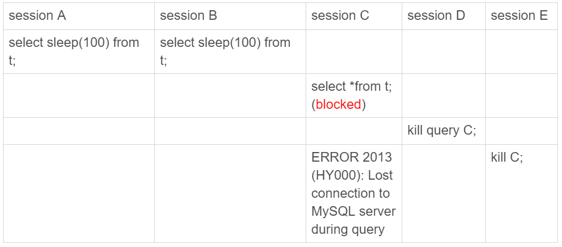

------


------


### 删除表中的数据

表数据既可以存在共享表空间里，也可以是单独的文件。这个行为是由参数 innodb_file_per_table 控制的：

这个参数设置为 OFF 表示的是，表的数据放在系统共享表空间，也就是跟数据字典放在一起；

这个参数设置为 ON 表示的是，每个 InnoDB 表数据存储在一个以 .ibd 为后缀的文件中。

从 MySQL 5.6.6 版本开始，它的默认值就是 ON 了

建议设置为ON，每个表单独是一个文件，这样当执行类似`drop table`的时候，会自动清理掉这个文件。而且也方便手工删除

删除数据，这是将数据设置为“可复用”，数据还是占据空间，数据大小不会因为删除数据而变小，而且由于存储结构是数，容易导致很多“空洞”，如果要优化空间，则需要重建表

可以使用命令`alter table A engine=InnoDB`来重建表


### 重建表

大致过程是创建一个临时表，然后将正式表的数据插入到临时表，然后将临时表替换为正式表

需要注意的是，这个操作会导致表格暂时无法更新，因为添加了MDL写锁，为了保证数据的一致性

在 MySQL 5.6 版本开始引入的 Online DDL，对这个操作流程做了优化，具体是插入数据到临时表的时候，允许正式表更新（即将MDL写锁，降级为MDL读锁），将更新操作记录到日志文件中，等临时表数据插入完毕，再根据日志文件同步最新数据。

注意：重建表的时候，InnoDB 不会把整张表占满，每个页留了 1/16 给后续的更新用。也就是说，其实重建表之后不是“最”紧凑的，因此，重建表后，可能占用空间反而变大

**一些语句的区分**

- 从 MySQL 5.6 版本开始，alter table t engine = InnoDB（也就是 recreate）默认的就是上面图 4 的流程了；
- analyze table t 其实不是重建表，只是对表的索引信息做重新统计，没有修改数据，这个过程中加了 MDL 读锁；
- optimize table t 等于 recreate+analyze。


### information_schema

关于锁的表包括三个：

- innodb_trx：记录了事务的相关信息
- innodb_locks：记录了当前锁的相关信息
- innodb_waits：记录了锁等待的对应关系

------

### 读写分离

在分布式环境下，为了保证DB的高可用性和负载均衡，借鉴Master-Slave的思想，将读数据的SQL语句发送到Slave库中，将写数据的SQL语句发送到Master库中，Master和Slave保持数据的一致性，如果Master库挂掉了，则Slave临时成为Master

由于不同的SQL语句要发送给不同的服务器，对于Tomcat来说有点麻烦，所以在Tomcat和DB中间加入MySQL Proxy这个中间层处理SQL语句的分发，这也是推荐使用的做法

#### 主从延迟下的读写分离解决方案

对于一主多从的架构，如果存在主从延迟，对业务逻辑更新后马上查询的场景，可能会导致查询到的是过期的数据，因为从库还没有同步完主库的数据。可以尝试的解决方案是：

```shell
强制走主库方案；
sleep 方案；
判断主备无延迟方案；
配合 semi-sync 方案；
等主库位点方案；
等 GTID 方案
```

**强制走主库方案；**

将请求区别对待，对于必须拿到最新数据的请求，强制发送到主库去执行；而对于其他请求则可以发送到从库查询

**sleep 方案；**

更新和查询之间，添加一条sleep语句

**判断主备无延迟方案；**

获取主备延迟时间，等待主备无延迟的时候才进行查询

判断主备无延迟可以通过下面的方法：

1. 通过show slave status 结果里的 seconds_behind_master 参数的值
2. 通过show slave status 结果中的，Read_Master_Log_Pos（主库的位点）和Exec_Master_Log_Pos（从库已经执行的位点）的值
3. 如果开启了GUID（Auto_Position=1），通过show slave status 结果中的，Retrieved_Gtid_Set（从库接收到的GTID集合）和Executed_Gtid_Set（从库执行的GTID集合）的值

不过，可能主库已经执行完且相应了客户端，但是binlog还没有发送给从库，从库会误以为无主备延迟，会发送过期数据给客户端

**配合 semi-sync 方案；**

为了处理上述问题，semi-sync 做了这样的设计：

1. 事务提交的时候，主库把 binlog 发给从库；
2. 从库收到 binlog 以后，发回给主库一个 ack，表示收到了；
3. 主库收到这个 ack 以后，才能给客户端返回“事务完成”的确认。

不过semi-sync只适用于一主一从，对于一主多从的架构，还是会存在过期数据的问题

而且当binlog更新很快的情况下，主备的GTID或者位点值总是不相等，容易导致过度等待的问题

**等主库位点方案；**

1. trx1 事务更新完成后，马上执行 show master status 得到当前主库执行到的 File 和 Position；
2. 选定一个从库执行查询语句；
3. 在从库上执行 select master_pos_wait(File, Position, 1)；
4. 如果返回值是 >=0 的正整数，则在这个从库执行查询语句；
5. 否则，到主库执行查询语句。

语句`select master_pos_wait(file, pos[, timeout]);`的效果是从命令开始执行，到应用完 file 和 pos 表示的 binlog 位置，执行了多少事务。

**等 GTID 方案**

1. trx1 事务更新完成后，从返回包直接获取这个事务的 GTID，记为 gtid1；
2. 选定一个从库执行查询语句；
3. 在从库上执行 select wait_for_executed_gtid_set(gtid1, 1)；
4. 如果返回值是 0，则在这个从库执行查询语句；
5. 否则，到主库执行查询语句。

` select wait_for_executed_gtid_set(gtid_set, 1);`这条命令的逻辑是：等待，直到这个库执行的事务中包含传入的 gtid_set，返回 0；超时返回 1。

相比较于“等主库位点方案”，减少了一次查主库位点的查询


### order by操作


线程会在内存中开辟一个空间`sort buffer`用来排序，当`sort_buffer_size`大于要排序的数据量时，使用快排在内存中进行内部排序，如果小于那么会利用磁盘临时文件辅助排序，使用归并进行外部排序，

使用以下的方法，来确定一个排序语句是否使用了临时文件?

```
/* 打开 optimizer_trace，只对本线程有效 */
SET optimizer_trace='enabled=on'; 
/* @a 保存 Innodb_rows_read 的初始值 */
select VARIABLE_VALUE into @a from  performance_schema.session_status where variable_name = 'Innodb_rows_read';
/* 执行语句 */
select city, name,age from t where city='杭州' order by name limit 1000; 
/* 查看 OPTIMIZER_TRACE 输出 */
SELECT * FROM `information_schema`.`OPTIMIZER_TRACE`\G
/* @b 保存 Innodb_rows_read 的当前值 */
select VARIABLE_VALUE into @b from performance_schema.session_status where variable_name = 'Innodb_rows_read';
/* 计算 Innodb_rows_read 差值 */
select @b-@a;
```

当中的`number_of_tep_files`指示使用了多少临时文件，如果为0，则只是内存排序，否则使用了临时文件辅助排序

#### 全字段排序

初始化sort_buffer，在二级索引中查找相应的数据，根据主键回表查找整行的数据，将数据放到sort buffer中，对sort buffer中的数据按照字段进行排序，将排好序的数据返回给客户端

#### rowid排序

如果一行的字段有很多的话，那么内存中能够放入的行数会很少，要分成为很多个临时的文件，排序的性能很差，因此可以设置
`SET max_length_for_sort_data = 16`,控制了用于排序的行数据的长度，如果超过了这个长度，那么进入sort buffer的字段只有主键和排序字段，最后排好序后需要进行回表查找完整的数据，所以通过上面计算的`select @b-@a`需要额外增加回表的行数

#### 全字段排序 VS rowid排序

- 对于InnoDB表来说，全字段排序能够减少磁盘的访问，因此会被优先选择
- 对于内存表来说，rowid排序的回表只是简单地根据数据行的位置，直接访问内存得到数据，并不会访问磁盘，因此对于只有内存操作来说，使用rowid排序更佳

#### 避免排序

- 如果有联合索引，那么可以避免排序，只需要在联合索引进行检索，回表查找相应数据按照顺序记录数据就可以(Using index condition)。比如有索引(city, name)，查询语句`select * from t where city = "guangzhou" order by name desc`
- 如果查询语句有覆盖索引，那么直接在联合索引处就能够获取足够的信息，不需要回表(Using index)，即查询语句：`select city, name, age from t  where city = "guangzhou" order by name desc`，而且有索引(city, name, age)，那么查询不需要回表

#### 额外的例子

> 查询语句：select * from t where city in ("杭州","苏州") ordr by name limit 100;
>
> 有联合索引(city,name)

那么执行过程如下所示：

1. 执行 select * from t where city=“杭州” order by name limit 100; 这个语句是不需要排序的，客户端用一个长度为 100 的内存数组 A 保存结果。
2. 执行 select * from t where city=“苏州” order by name limit 100; 用相同的方法，假设结果被存进了内存数组 B。
3. 现在 A 和 B 是两个有序数组，然后你可以用归并排序的思想，得到 name 最小的前 100 值，就是我们需要的结果了。

对于explain中的Extra，如果显示：`Using filesort`，则表示使用了排序

### count操作

InnoDB执行count操作需要将数据从存储引擎一行行读取到Server层，然后累积计数，原因是因为MVVC的缘故，需要判断每一行数据对于当前的事务是否可见，可见才累积计数

#### 怎么解决？

##### 用缓存系统（如Redis）存储计数值

然而毕竟内存数据会丢失，所以需要将数据写入到磁盘中，不过即使Redis正常工作，还是可能存在不一致，因为Redis数据更新和数据表的数据插入毕竟是两个操作，不是原子的，如果有查询在这两个操作之间进行了查询那么返回的数据就是不一致的

##### 数据库表来保存计数值

由于InnoDB要支持事务，所以执行count操作需要一行行读取到Server层

因此其实我们可以用一个表格来保存计数值，同时借助事务的特性，来解决使用Redis等第三方存储计数容易数据不一致的问题

#### 不同的count

优化器对count（*）进行了优化，不需要把全部字段取出来，不取值，按行累加，速度更快

具体的：主键索引由于叶子节点是具体的数据，而普通索引叶子节点只是主键，因此主键索引的大小要大于普通索引，InnoDB存储引擎会寻找最小的索引树，来执行count(*)操作，能够减少扫描的数据量

对于 count(主键 id) 来说，InnoDB 引擎会遍历整张表，把每一行的 id 值都取出来，返回给 server 层。server 层拿到 id 后，判断是不可能为空的，就按行累加。

对于 count(1) 来说，InnoDB 引擎遍历整张表，但不取值。server 层对于返回的每一行，放一个数字“1”进去，判断是不可能为空的，按行累加。

对于 count(字段) 来说：

- 如果这个“字段”是定义为 not null 的话，一行行地从记录里面读出这个字段，判断不能为 null，按行累加；

- 如果这个“字段”定义允许为 null，那么执行的时候，判断到有可能是 null，还要把值取出来再判断一下，不是 null 才累加。

性能上

> count(*) = count(1) > count(主键id) > count(字段)


### 分页查询

通常的做法是这样的：`LIMIT 10000, 20`

不过`OFFSET`的效率是很低的，优化的办法是使用`id`字段，即`WHERE id > 2000 LIMIT 10`，达到的效果是一样的，效率却很高，不过请求mysql的时候需要传递之前查找到的最大id值

### 随机数

获取随机数，可以使用的语句是：`select word from words order by rand() limit 3;`，需要注意的是，这个操作是比较繁琐的，而且也不推荐使用

- `order by rand()`使用了内存临时表(Using temporary)，内存临时表排序的时候是使用rowid排序方法
- `tmp_table_size`：内存临时表的大小，默认是16M，如果临时表大小超过了`tmp_table_size`，那么内存临时表就会转成磁盘临时表

#### 优先队列排序算法(堆排序)

当要排序的数据超过了tmp_table_size时，就不使用内存临时表了，如果limit a中a的值比较小，如果a的数据量不超过sort_buffer_size，那么会使用该算法，可以通过查看"filesort_priority_queue_optimization"中的"chosen字段是否为true来看是否使用了该算法

#### 取随机数的方法

```
取一个
mysql> select count(*) into @C from t;
set @Y = floor(@C * rand());
set @sql = concat("select * from t limit ", @Y, ",1");
prepare stmt from @sql;
execute stmt;
DEALLOCATE prepare stmt;

取三个
mysql> select count(*) into @C from t;
set @Y1 = floor(@C * rand());
set @Y2 = floor(@C * rand());
set @Y3 = floor(@C * rand());
set @M = max(@Y1,@Y2,@Y3)
set @N = min(@Y1,@Y2,@Y3)

select * from (
	select * from t limit N, M-N+1
) a
where a.id in (@Y1, @Y2, @Y3)
这样整体的扫描行数是 C + M + 3;

```

------

### 备份例子

```
set session transaction isolation level repeatable read;设置隔离级别
start transaction with consistent snapshop;得到一致性视图
savepoint sp;
show create table t1;
select * from t1;
rollback to savepoint sp;
继续对其他表重复上述过程
```

### 慢查询日志
slow log

#### 查看设置

- `show variables like 'slow_query%';`
- `show variables like 'long_query_time';`

#### 设置

- `set global slow_query_log='ON';`
- `set global slow_query_log_file='/usr/local/mysql/data/slow.log';`
- `set global long_query_time=1;`
- 重启客户端

使语句的执行保存到慢查询日志中

```mysql
set long_query_time=0;
select * from t ...
...
```


### 执行很慢的原因

#### 查询长时间不返回

##### 等MDL锁

1. show processlist看到State是“Waiting for table metadata lock"
2. 查找阻塞的pid，`select blocking_pid from sys.schema_table_lock_waits;`，需要注意的是，MySQL 启动时需要设置 performance_schema=on
3. KILL PID

##### 等Flush

1. show processlist看到State是“Waiting for table flush"
2. 但是一般flush的操作是很快的，所以应该是flush被其他线程A给堵住了
3. 将A线程给杀死

##### 等行锁

1. mysql> select * from t where id=1 lock in share mode; 
2. 该命令需要加读锁，如果已经有一个事务在这行持有一个写锁，那么select语句就会被阻塞
3. 查找这行持有写锁的信息：mysql> select * from t sys.innodb_lock_waits where locked_table=`'test'.'t'`\G
4. 可以看到“blocking_pid"就是阻塞的pid
5. 将持有写锁的pid杀掉：KILL PID

#### 查询慢

##### 例子1

`select * from t where id=1;`执行慢

`select * from t where id=1 lock in share mode;`执行反而快

场景如下：

| session A                                      | session B                                 |
| ---------------------------------------------- | ----------------------------------------- |
| start transaction with consistent snapshot;    | ~                                         |
| ~                                              | update t set c=c+1 where id=1 //执行100次 |
| select * from t where id=1;                    |                                           |
| select * from t where id=1 lock in share mode; |                                           |

- lock in share mode是当前读，会直接读到c的最新值
- 而普通的是一致性读，需要从c最新的值开始，一直undo执行了100次后，才能将数据返回，执行慢

##### 例子2

b字段定义为varchar(10)，且表中有10万行的b值为“1234567890”，执行语句`mysql> select * from table_a where b='1234567890abcd';`，这个语句执行很慢，原因是

mysql会将字符串截断为10个char的长度，由于是select*，所以需要回表10万次，但是每次查出整行，到server层一判断发现b字段不相同，最终结果返回空，如果N很大的话，那么花费的时间很多


### 避免对字段进行函数操作

对索引字段做函数操作，可能会破坏索引值的有序性，因此优化器就决定放弃走树搜索功能，导致的结果就是查询速度很慢

#### 对字段做了函数操作

- select * from TABLE where id + 1 = 100;
- select * from TABLE where month(t) = 7;
- 解决方式是不对字段使用函数，而是使用范围

#### 隐式类型转换

- select * from TABLE where tradeid = 100;(tradeid为varchar) 
- 在sql中，字符串和数字作比较的话，是将字符串转换成为数字
- 上面的语句等价于select * from TABLE where CAST(tradeid as signed int) = 100

#### 隐式字符编码转换

1. `select d.* from tradelog l, trade_detail d where d.tradeid=l.tradeid and l.id=2;`

2. 由于表d的字符集是utf8，而表l的字符集是utf8mb4，因此上面对字段进行了函数操作


**优化方法**

- 把trade_detail表中的tradeid字段的字符集修改为utf8mb4： `alter table trade_detail modify tradeid varchar(32) CHARACTER SET     utf8mb4 default null;`
- `select d.* from tradelog l , trade_detail d where d.tradeid=CONVERT(l.tradeid USING utf8) and l.id=2; `


### 幻读

可重复读事务隔离级别下，会存在幻读的情况。幻读指的是在一个事务中的两次查询，第二次查询查到了第一次查询不存在的数据行。

需要注意的是，对于普通的读是快照读，是不存在幻读的，而对于“当前读”，才会出现幻读。而且幻读仅仅指看到新插入的行，由于更新操作而导致的查询到新数据行不称为幻读。


InnoDB解决幻读的方式是使用间隙锁，用来锁行与行之间的间隙，从而阻塞其他事务的插入操作

间隙锁和行锁合称 next-key lock，每个 next-key lock 是前开后闭区间。

但是引入了间隙锁，会导致死锁问题，比如：

| session A                                           | session B                                           |
| --------------------------------------------------- | --------------------------------------------------- |
| begin;<br />select * from t where id=10 for update; |                                                     |
|                                                     | begin;<br />select * from t where id=10 for update; |
|                                                     | insert into t values(10, 10, 10);(阻塞)             |
| insert into t values(10, 10, 10);(阻塞)             |                                                     |
|                                                     |                                                     |


```mysql
session A 执行 select … for update 语句，由于 id=10 这一行并不存在，因此会加上间隙锁 (5,11);
session B 执行 select … for update 语句，同样会加上间隙锁 (5,11)，间隙锁之间不会冲突，因此这个语句可以执行成功；
session B 试图插入一行(10, 10, 10)，被 session A 的间隙锁挡住了，只好进入等待；
session A 试图插入一行(10, 10, 10)，被 session B 的间隙锁挡住了。
至此，形成了死锁，如果开启了死锁检测的话，SessionA会马上被检测然后返回错误，从而解除死锁
```

间隙锁只存在于可重复读隔离界别，为了解决幻读可以将事务隔离级别设置为读提交，同时为了解决可能出现的数据和日志不一致问题，需要设置binlog_format=row

如果读提交隔离级别够用，也就是说，业务不需要可重复读的保证，这样考虑到读提交下操作数据的锁范围更小（没有间隙锁），使用这个配置是合理的。当然，配置是否合理，跟业务场景有关，需要具体问题具体分析


### 出现问题时临时方案

#### 连接过多

当报错提示“Too many connections”时，增加`max_connections`的值，但是可能会导致MySql负载过大，破坏稳定性。更推荐的做法是将那些建立了连接但是并没有执行操作的（状态为Sleep）、无事务的连接杀死，是否有事务通过命令查看`select * from information_schema.innodb_trx`，杀死连接通过`kill connection + id`

当连接被MySql服务器杀死后，客户端在下一次请求的时候，才会提示错误：`ERROR 2013 (HY000): Lost connection to MySQL server during query”`，客户端需要重新建立连接，然后使用新的连接发送请求

#### 慢查询

1. 缺少索引，通过Online DDL马上添加索引，对于一主一从，可以进行如下操作：
   1. 在备库 B 上执行 set sql_log_bin=off，也就是不写 binlog，然后执行 alter table 语句加上索引；
   2. 执行主备切换；
   3. 这时候主库是 B，备库是 A。在 A 上执行 set sql_log_bin=off，然后执行 alter table 语句加上索引。
2. 选错索引或者语句没有写好，通过query_rewrite功能，增加`force index`

#### QPS增加

1. 一种是由全新业务的 bug 导致的。假设你的 DB 运维是比较规范的，也就是说白名单是一个个加的。这种情况下，如果你能够确定业务方会下掉这个功能，只是时间上没那么快，那么就可以从数据库端直接把白名单去掉。
2. 如果这个新功能使用的是单独的数据库用户，可以用管理员账号把这个用户删掉，然后断开现有连接。这样，这个新功能的连接不成功，由它引发的 QPS 就会变成 0。
3. 如果这个新增的功能跟主体功能是部署在一起的，那么我们只能通过处理语句来限制。这时，我们可以使用上面提到的查询重写功能，把压力最大的 SQL 语句直接重写成"select 1"返回，不过不一定有效，因为一般来说不会只有一类SQL语句。


### union all 和union

都是将两个select结果集进行合并，区别如下

- 对于有重复的行，union会进行去重，而union all不会；
- 对于有序的结果，union会重新进行排序，而union all只是简单拼接两个结果

性能的话当然是union all更快

### 反引号

mysql语句的表名和字段都会添加反引号(`\``)，目的是为了区分Mysql的保留字和普通字符，当使用了保留字作为字段的话不加反引号会报错，比如

```
create table `test` (
    `id` bigint(20) NOT NULL AUTO_INCREMENT,
    `rank` varchar(10)
    `desc` varchar(255)
)
```

在8.0版本，rank是关键字，如果不加反引号会报错


### 优化

大小表join使用mapjoin
字段和值类型匹配
在关联之前，将条件过滤放到字句
查询sql中过滤掉脏数据
避免笛卡尔积 
先groupby 后在join
增加分区信息，减少sql解析时的内存占用

#### select

- 对于查询结果只有一条的，加上`limit 1`，这样找到结果后就不会再继续扫描
- 如果允许重复并且不要排序结果，使用union all而不是union

### Interesting SQL

- `update tbl_name set str_col="xxx" = "yyy"` 等同于 `update tbl_name set str_col=0`
- `select id,str_col from tbl_name where str_col="xxx" = "yyy";`


### 多表join
阿里巴巴java开发手册说，禁止超过3个表以上的join，而且需要确保索引存在。优化的方式是，拆分sql语句为多条简单的sql语句，整体上来看，多条简单sql语句效率会比一条多表join的sql语句要高


### query_rewrite 功能

MySQL 5.7 提供了 query_rewrite 功能，可以把输入的一条语句改写成另外一条语句

通过执行`mysql-5.7.34-winx64\share\install_rewriter.sql`安装功能

新增规则：`insert into query_rewrite.rewrite_rules(pattern, replacement, pattern_database) values ("select * from t where id + 1 = ?", "select * from t where id = ? - 1", "db1");`

使规则生效：`call query_rewrite.flush_rewrite_rules();`

在执行语句后，可以通过`show warnings`查看语句是否进行了变更


### 误删除操作

#### delete删除行

使用`Flashback`工具通过修改binlog（生成逆转操作）来恢复原始数据，需要设置了`binlog_format=row 和 binlog_row_image=FULL`。最好的做法是在从库上使用工具回复原始数据，确认数据后在同步到主库

#### drop table/ truncate table删除表、删除数据库

前提条件是数据库有定时全量备份，并且实时备份binlog。具体的恢复就是全量备份+增量binlog日志的方式，比如，每日有进行一次全量的备份，中午12点时删了表，具体操作是：

1. 获取最近一次的全量备份，应用到一个临时库中
2. 获取0点以后的所有binlog，剔除掉删表的语句，具体：
   1. 如果原实例没有使用 GTID 模式，只能在应用到包含 12 点的 binlog 文件的时候，先用–stop-position 参数执行到误操作之前的日志，然后再用–start-position 从误操作之后的日志继续执行；
   2. 如果实例使用了 GTID 模式，就方便多了。假设误操作命令的 GTID 是 gtid1，那么只需要执行 set gtid_next=gtid1;begin;commit; 先把这个 GTID 加到临时实例的 GTID 集合，之后按顺序执行 binlog 的时候，就会自动跳过误操作的语句。
3. 全部应用到临时库中，具体是`mysqlbinlog –database db_name`
4. 将临时库中的表同步到MySql集群中

不过，上述的操作不够快，主要原因是mysqlbinlog不能指定表，恢复的是整个数据库；其次，mysqlbinlog解析日志和应用日志的过程是单线程的

更快的方法如下：

1. 使用全量备份生成临时实例后，将其设置为线上备库的从库
2. 设置`change replication filter replicate_do_table = (tbl_name)`，表示只同步指定的表，然后`start slave`。需要注意的是，备库中需要有0点后的全部binlog，如果缺少了部分binlog，我们需要手工从其他binlog备份中获取并添加到备库中，具体：
   1. 假设通过`show binlog`查看到备库中最小的binlog文件是master.000004，缺少了master.000003（判断是否缺少看binlog中的时间）
   2. 从其他binlog备份中获取master.000003，放置到备库中
   3. 打开日志文件中的`master.index`，添加`./master.000003`
   4. 重启备库，使其识别到新的binlog
3. 至此备库中已经存在全部的binlog了， 建立主备关系后即可

再比如全量备份是一周一次，然后在周六的时候误操作了，那么需要重放6天的binlog，还是很慢，对于这种场景，可以尝试配置延迟同步的备库，在备库上执行`CHANGE MASTER TO MASTER_DELAY = N` 命令，可以指定这个备库持续保持跟主库有 N 秒的延迟。如果设置了3600，则表示备库和主库有1个小时的延迟，如果在1个小时内发现了误操作，操作是：

1. 马上停止同步备库：`stop slave`
2. 将主库中的binlog剔除掉误操作的日志，在备库重放，可以很快得获取到原始数据

#### rm 删除数据库实例

删除实例的影响是最小的，因为其不会影响数据的一致性，只会让整个集群压力增大，只需要重新启动数据库实例即可

#### 预防措施

1. 把 sql_safe_updates 参数设置为 on。这样一来，如果我们忘记在 delete 或者 update 语句中写 where 条件，或者 where 条件里面没有包含索引字段的话，这条语句的执行就会报错。
2. 代码上线前，必须经过 SQL 审计。
3. 只给开发配置DML，不允许drop/truncate
4. 在删除数据表之前，先将表重命名为其他名字，比如添加统一删除后缀`_to_be_delete`，观察现场日志是否存在问题，不存在在问题则由DB统一删除具有统一后缀的表


### 查询后的数据发送给客户端

查询数据，MqSql是边读边发，意味着，如果客户端接收的慢，也会导致mysql发送得慢，具体如下：

1. MySql的Server层从存储引擎中获取到一行数据后，将数据写入到`net buffer`，大小由`net_buffer_length`控制，默认是16K
2. 重复获取行，写入`net buffer`，直到其写满，然后调用网络接口发送出去
3. 如果发送成功，则清空`net buffer`，获取下一行数据
4. 如果调用接口失败，返回EAGAIN 或 WSAEWOULDBLOCK，则表示本地网络栈(Socket send buffer)满了，需要等待，直到本地网络栈可写

如果连接的状态显示“Sending to client”，就表示服务器端的网络栈写满了。

如果客户端使用–quick 参数，会使用 mysql_use_result 方法。这个方法是读一行处理一行，如果业务逻辑处理比较慢，会导致客户端接受慢，继而导致mysql服务端本地网络栈堆积

因此，如果数据量可以接收，一般使用mysql_store_result 这个接口，mysql客户端直接把查询结果保存到本地内存。

#### 大数据量全表扫描的影响

数据查询后会放置在Buffer Pool中，下一次相同的查询，可以直接返回而不用查询磁盘，提高了查询效率，Buffer Pool的命中率可以通过`show engine innodb status`中的信息查看

InnoDB Buffer Pool的大小由`innodb_buffer_pool_size`进行控制，通常设置为可用物理内存的60%~80%。

对于大数据量的查询，容易将Buffer Pool塞满，然后通过LRU算法淘汰掉常用的数据查询，导致Buffer Pool的命中率直线下降，磁盘压力增大，影响常用数据查询的效率。

实际上，InnoDB对LRU算法进行了优化的，其将整条链表分成两部分，按照5:3的比例，分别是Young区域和Old区域，Old区域的头为OLD_HEAD。改进后的策略是：

1. 如果查询的数据在Young区域，那么将数据移动到Head；
2. 如果Buffer Pool满了，那么还是淘汰掉链条尾部的数据，将数据插入到OLD_HEAD
3. 如果查询的数据在Old区域：
   1. 数据在链表存在不足1秒，将数据移动到Old区域的Head，即OLD_HEAD;
   2. 数据在链表存在超过了1秒，那么将数据移动到Young区域的头部，即HEAD;
   3. 上述时间由参数`innodb_old_blocks_time`控制，默认是1000，单位是毫秒

可以看到，对于大数据量的全表扫描，数据只会存在于Old区域，不会淘汰Young区域的数据，因此能够保证正常业务逻辑数据的查询


### 用户和权限

mysql中，用户名（user）+地址（host)才是一个用户，因此，`jy@localhost`和`jy@192.168.53.2`，是两个用户

创建用户：`create user 'ua'@'%' identified by 'pa';`

创建用户的操作，会在磁盘上，往 mysql.user 表里插入一行，由于没有指定权限，所以这行数据上所有表示权限的字段的值都是 N；内存里，往数组 acl_users 里插入一个 acl_user 对象，这个对象的 access 字段值为 0。

#### 全局权限

赋予全部权限：`grant all privileges on *.* to 'ua'@'%' with grant option;`

这个 grant 命令做了两个动作：磁盘上，将 mysql.user 表里，用户’ua’@’%'这一行的所有表示权限的字段的值都修改为‘Y’；内存里，从数组 acl_users 中找到这个用户对应的对象，将 access 值（权限位）修改为二进制的“全 1”。

收回用户的权限：`revoke all privileges on *.* from 'ua'@'%';`

#### DB权限

赋予权限：`grant all privileges on db1.* to 'ua'@'%' with grant option;`

基于库的权限记录保存在 mysql.db 表中，在内存里则保存在数组 acl_dbs 中。

这条 grant 命令做了如下两个动作：磁盘上，往 mysql.db 表中插入了一行记录，所有权限位字段设置为“Y”；内存里，增加一个对象到数组 acl_dbs 中，这个对象的权限位为“全 1”。

#### 全局权限和DB权限

对于全局权限，在线程建立连接后会将权限信息复制到线程对象中，因此对于全局权限进行`revoke`，不会影响已经建立的连接

对于DB权限，线程是对全局变量acl_dbs进行判断，因此对于DB权限进行`revoke`，立即就会修改acl_dbs数组，因此会影响已经建立的连接

而对于一开始就执行了`use db_test`，会将对数据库的权限写入到会话变量中，除非切换数据库，否则会话持有的对db_test的权限不会改变


#### 表权限和列权限

```
create table db1.t1(id int, a int);
// 表权限
grant all privileges on db1.t1 to 'ua'@'%' with grant option;
// 列权限
GRANT SELECT(id), INSERT (id,a) ON mydb.mytbl TO 'ua'@'%' with grant option;
```

除了 db 级别的权限外，MySQL 支持更细粒度的表权限和列权限。其中，表权限定义存放在表 mysql.tables_priv 中，列权限定义存放在表 mysql.columns_priv 中。这两类权限，组合起来存放在内存的 hash 结构 column_priv_hash 中。

和DB权限一样，这两类权限都会更新数据表，更新内存，会影响到所有的已建立的连接

flush privileges 命令会清空 acl_users 数组，然后从 mysql.user 表中读取数据重新加载，重新构造一个 acl_users 数组。也就是说，以数据表中的数据为准，会将全局权限内存数组重新加载一遍。同样的，DB权限，表权限和列权限也做了相同的处理。

因此，正常情况下，grant 命令之后，没有必要跟着执行 flush privileges 命令。

flush privileges 使用场景：

一般是非规范的操作，导致了数据表和内存数据不一致，比如直接修改了mysql.user的数据，那么需要通过语句更新内存的数据。


### 节点健康检测

建立对mysql节点的健康监测，当监测显示节点存在异常时，需要及时进行主备切换、节点下线等操作，常用的监测方法如下：

#### select 1

通过执行`select 1`，如果有返回则表表示节点正常，否则异常

但是对于线程数量用尽，新的请求无法执行的情况，`select 1`还是会正常返回结果，无法及时获取到该节点的请求已阻塞

#### 查表判断

为了能够检测到InnoDB并发线程数太多而导致不可用的情况，需要执行访问表的语句，可以构建一个表`health_check`，里面只有一行数据，然后定期执行`select * from health_check`，看是否能够返回结果

但是查表操作，无法判断binlog写满后，更新操作阻塞的情况，因此需要将查表语句修改为更新语句

#### 更新判断

表增加一个timestamp子字段，定期执行语句`update mysql.health_check set t_modified=now();`

对于一主多从的mysql集群，需要同时监测主节点和从节点，如果在所有节点上执行以上语句，会导致数据不一致，进而导致主从同步停止，因此执行的语句需要增加节点的标识，即增加server_id字段

```mysql
mysql> CREATE TABLE `health_check` (
  `id` int(11) NOT NULL,
  `t_modified` timestamp NOT NULL DEFAULT CURRENT_TIMESTAMP,
  PRIMARY KEY (`id`)
) ENGINE=InnoDB;

/* 检测命令 */
insert into mysql.health_check(id, t_modified) values (@@server_id, now()) on duplicate key update t_modified=now();
```

需要注意的是，以上的方法（select 1、查表判断、更新判断）都是在mysql外部判断健康状况，存在一定的随机性，可能不能及时监测到

#### 开启mysql的性能监控

而如果对mysql本身的数据进行监测判断，则能够做到准确监测，MySQL 5.6 版本以后提供的 performance_schema 库，就在 file_summary_by_event_name 表里统计了每次 IO 请求的时间，如果开启了这个统计功能，会导致mysql的性能下降10%左右。

开启redo log的时间监控：`mysql> update setup_instruments set ENABLED='YES', Timed='YES' where name like '%wait/io/file/innodb/innodb_log_file%';`

监测数据，设定阈值，单次 IO 请求时间超过 200 毫秒属于异常：`mysql> select event_name,MAX_TIMER_WAIT  FROM performance_schema.file_summary_by_event_name where event_name in ('wait/io/file/innodb/innodb_log_file','wait/io/file/sql/binlog') and MAX_TIMER_WAIT>200*1000000000;`

发现异常数据后，获取需要的信息，然后将之前的统计信息清空`mysql> truncate table performance_schema.file_summary_by_event_name;`，当下一次出现异常信息后，将值添加到监控累计值即可。

### 数据导出和导入

下面的例子是将db1.t的数据复制到db2.t

#### mysqldump

导出：

```mysql
mysqldump -h$host -P$port -u$user --add-locks=0 --no-create-info --single-transaction  --set-gtid-purged=OFF db1 t --where="a>900" --result-file=/wasHome/client_tmp/t.sql

--single-transaction：不对表db1.t加表锁
–add-locks 设置为 0，表示在输出的文件结果里，不增加" LOCK TABLES t WRITE;" ；
–no-create-info 的意思是，不需要导出表结构；
–set-gtid-purged=off 表示的是，不输出跟 GTID 相关的信息；
–skip-extended-insert：一行数据一行insert
```

下面的两种导入都可以

导入：`mysql -h127.0.0.1 -P13000  -uroot db2 -e "source /client_tmp/t.sql"`

导入：`mysql -h127.0.0.1 -P13000  -uroot db2  < /client_tmp/t.sql`

#### CSV 

导出：`select * from db1.t where a>900 into outfile '/server_tmp/t.csv';`

导出文件的路径受secure_file_priv的控制：如果设置为 empty，表示不限制文件生成的位置，这是不安全的设置；如果设置为一个表示路径的字符串，就要求生成的文件只能放在这个指定的目录，或者它的子目录；如果设置为 NULL，就表示禁止在这个 MySQL 实例上执行 select … into outfile 操作。

导入：`load data infile '/server_tmp/t.csv' into table db2.t;`

select …into outfile 方法不会生成表结构文件，只有数据

mysqldump 提供了一个–tab 参数，可以同时导出表结构定义文件和 csv 数据文件，分别为t.sql和t.txt

`mysqldump -h$host -P$port -u$user ---single-transaction  --set-gtid-purged=OFF db1 t --where="a>900" --tab=$secure_file_priv`

#### 物理拷贝

以上的方法都是逻辑拷贝，即先生成源数据，然后将源数据导入到新表中。

mysql提供了物理拷贝，即直接操作.ibd文件，这种方式是最快的，具体流程：

1. 执行 create table r like t，创建一个相同表结构的空表；
2. 执行 alter table r discard tablespace，这时候 r.ibd 文件会被删除；
3. 执行 flush table t for export，这时候 db1 目录下会生成一个 t.cfg 文件；
4. 在 db1 目录下执行 cp t.cfg r.cfg; cp t.ibd r.ibd；这两个命令（这里需要注意的是，拷贝得到的两个文件，MySQL 进程要有读写权限）；
5. 执行 unlock tables，这时候 t.cfg 文件会被删除；
6. 执行 alter table r import tablespace，将这个 r.ibd 文件作为表 r 的新的表空间，由于这个文件的数据内容和 t.ibd 是相同的，所以表 r 中就有了和表 t 相同的数据。


### 数据可靠性

数据的可靠性依赖于日志的及时落盘，只要保证redo log和binlog持久化到磁盘，mysql数据库异常重启后，数据可以恢复，提供一定的数据可靠性。

#### binlog的写入机制

事务执行过程中，先将日志写入到binlog cache中，事务提交的时候，再把binlog cache写到硬盘的binlog文件中

每个线程都有独立的binlog cache，在内存中占据一定的空间，大小由`binlog_cache_size`控制，从binlog cache到磁盘的binlog文件会有两个过程：

- write：binlog cache到文件系统的page cache，所有线程的binlog cache 都共享同一个page cache binlog文件，此时还不是写磁盘，速度快
- fsync：真正的写磁盘，此时才占用磁盘的IOPS，速度慢

write 和 fsync 的时机，是由参数 sync_binlog 控制的：

- sync_binlog=0 的时候，表示每次提交事务都只 write，不 fsync；
- sync_binlog=1 的时候，表示每次提交事务都会执行 fsync；
- sync_binlog=N(N>1) 的时候，表示每次提交事务都 write，但累积 N 个事务后才 fsync。

#### redo log的写入机制

日志先写到 redo log buffer，然后根据策略`innodb_flush_log_at_trx_commit`写入到磁盘：

- 设置为 0 的时候，表示每次事务提交时都只是把 redo log 留在 redo log buffer 中 ;
- 设置为 1 的时候，表示每次事务提交时都将 redo log 直接持久化到磁盘；
- 设置为 2 的时候，表示每次事务提交时都只是把 redo log 写到 page cache。

而且mysql后台有起一个定时任务，每秒执行，会将redo log buffer中的的日志，调用 write 写到文件系统的 page cache，然后调用 fsync 持久化到磁盘

对于还没有提交的事务，redo log也可能会被持久化到磁盘，比如

对于并发事务，事务A写了部分redo log到redo log buffer中，但是还没有提交，而事务B进行了提交，如果``innodb_flush_log_at_trx_commit = 1`，那么事务B会将redo log buffer中的全部内容持久化到磁盘，因此导致事务A还没提交但是持久化到了磁盘

如果把 innodb_flush_log_at_trx_commit 设置成 1，那么 redo log 在 prepare 阶段就要持久化一次，在commit的时候也要提交一次

#### 组提交机制

即将多个需要持久化的操作在一次磁盘IO中完成，主要是指fsync操作，能够大幅降低磁盘的IOPS

通常来说，写日志的大致过程是：

redo log prepare持久化 -> binlog持久化 ->redo log commit持久化，

而实际上由于持久化包括write和fsync两个操作，且两个操作一个快速，一个缓慢，细化后的写日志过程是：

redo log prepare write -> binlog write -> redo log prepare fsync-> binlog fsync->redo log commit持久化

redo log prepare fsync和binlog fsync操作都可以使用组提交机制，通常来说redo log prepare fsync执行相对较快，因此binlog fsync操作的日志数量还是较少，因此如果稍微“等待”一下，使得一次IO操作能够有更多的日志，可以提高mysql的IO性能，可以通过设置下面两个参数来实现。

- binlog_group_commit_sync_delay 参数，表示延迟多少微秒后才调用 fsync;
- binlog_group_commit_sync_no_delay_count 参数，表示累积多少次以后才调用 fsync。

两个参数是或操作，只要有一个满足条件就会调用fsync


### 主备同步

通常来说，备库最好设置为只读（readonly），原因是：

1. 备库可以执行一些读操作，设置为只读可以避免业务系统不小心发送了其他命令导致错误；
2. 避免主备切换的时候，由于双写导致的数据不一致；
3. 设置为只读，方便判断节点的状态

同步的操作具体是：

1. 在备库 B 上通过 change master 命令，设置主库 A 的 IP、端口、用户名、密码，以及要从哪个位置开始请求 binlog，这个位置包含文件名和日志偏移量。
2. 在备库 B 上执行 start slave 命令，这时候备库会启动两个线程，就是图中的 io_thread 和 sql_thread。其中 io_thread 负责与主库建立连接。
3. 主库 A 校验完用户名、密码后，开始按照备库 B 传过来的位置，从本地读取 binlog，发给 B。
4. 备库 B 拿到 binlog 后，写到本地文件，称为中转日志（relay log）。
5. sql_thread 读取中转日志，解析出日志里的命令，并执行。


对于双M架构，即主节点和从节点互为主备，主备同步的过程：

1. 节点A执行事务后生成的binlog，server id是A。
2. 节点B接收到binlog后，重放，然后节点B生成的binlog中，server id还是A
3. 节点A接收到的binlog，发现server id是A，即自己，将跳过这条binlog，即只执行server id不是自己的binlog内容


### 主备切换

高可用架构一般是双M架构，有一个备库随时等待选主为master，由于主从同步会存在延迟，延迟可以通过下面查看：

```shell
show slave status 
它的返回结果里面会显示 seconds_behind_master，即为同步延迟的时间
```

主备延迟的原因：

1. 备库所在的机器性能比主库差；
2. 备库通常会分担业务系统的查询请求，如果查询请求导致备库压力过大，会导致备库执行主库的binlog效率低下；
3. 大事务。因为事务提交的时候，才会生成binlog发送给备库，备库才会重放binlog，如果大事务执行时间长，那么将会导致长时间的主备延迟。典型的场景比如大数据量的delete，或者大表的DDL操作
4. 备库的并行复制能力低。

主备切换根据场景可以分为：可靠性优先策略和可用性优先策略

可靠性优先策略：

1. 判断备库 B 现在的 seconds_behind_master，如果小于某个值（比如 5 秒）继续下一步，否则持续重试这一步；
2. 把主库 A 改成只读状态，即把 readonly 设置为 true；
3. 判断备库 B 的 seconds_behind_master 的值，直到这个值变成 0 为止；
4. 把备库 B 改成可读写状态，也就是把 readonly 设置为 false；
5. 把业务请求切到备库 B。

这种策略能够保证数据有较高的可靠性，但是会存在短暂的不可用（比如5秒）

可用性优先策略：

可用性优先策略是不等主备数据同步，直接把连接切到备库 B，并且让备库 B 可以读写，可能会导致部分数据不一致。

通常来说，数据更为重要，因此最好使用可靠性优先策略


#### 一主多从的主备切换

假设主节点为A，从节点为B和C

当主节点故障之后，需要将B设置为主节点，同时将A和C设置为B的从节点

```shell
在从节点上执行：
CHANGE MASTER TO 
MASTER_HOST=$host_name 
MASTER_PORT=$port 
MASTER_USER=$user_name 
MASTER_PASSWORD=$password 
MASTER_LOG_FILE=$master_log_name 
MASTER_LOG_POS=$master_log_pos  

最后两个是binlog的信息，一个是文件的名字，一个是开始同步的位置
```

同步位置的获取方法可以是：

1. 等待一段时间，使B将中转日志全部处理完毕
2. 在B上执行`show master status`，获取binlog的名字和最新pos
3. 获取A故障的时间T
4. 在节点B上执行，获取新的同步位置，即故障时间后的：`mysqlbinlog File --stop-datetime=T --start-datetime=T`

当然了这样的方式得到的binlog pos是不准确的，可能同步过程中会报错，原因是pos后面的日志从节点已经执行过了，可以通过下面的操作跳过错误的日志：

```shell
1. 主动跳过事务
set global sql_slave_skip_counter=1;
start slave;

2. 跳过指定错误类型
set global slave_skip_errors = "1032,1062";
start slave;
其中：
1062 错误是插入数据时唯一键冲突；
1032 错误是删除数据时找不到行。
注意：等主备关系稳定后，需要重新设置值为空
```


主备切换最好的做法是使用GTID（Global Transaction Identifier），为全局事务ID，GTID由两部分构成，GTID=server_uuid:gno

server_uuid 是一个实例第一次启动时自动生成的，是一个全局唯一的值；

gno 是一个整数，初始值是 1，每次提交事务的时候分配给这个事务，并加 1。


**启用GTID**

示例启动的时候加上参数 gtid_mode=on 和 enforce_gtid_consistency=on


**GTID的使用**

如果 gtid_next=automatic，代表使用默认值。这时，MySQL 就会把 server_uuid:gno 分配给这个事务。

a. 记录 binlog 的时候，先记录一行 SET @@SESSION.GTID_NEXT=‘server_uuid:gno’;

b. 把这个 GTID 加入本实例的 GTID 集合。

如果 gtid_next 是一个指定的 GTID 的值，比如通过 set gtid_next='current_gtid’指定为 current_gtid，那么就有两种可能：

a. 如果 current_gtid 已经存在于实例的 GTID 集合中，接下来执行的这个事务会直接被系统忽略；

b. 如果 current_gtid 没有存在于实例的 GTID 集合中，就将这个 current_gtid 分配给接下来要执行的事务，也就是说系统不需要给这个事务生成新的 GTID，因此 gno 也不用加 1。

每个 MySQL 实例都维护了一个 GTID 集合，用来对应“这个实例执行过的所有事务”。可以使用命令`show master status`查看

比如从库A同步主库B的日志的时候，发现某条日志报错了，可以在从库A上操作：

```mysql
set gtid_next='aaaaaaaa-cccc-dddd-eeee-ffffffffffff:10';
begin;
commit;
set gtid_next=automatic;
start slave;

其中gtid_next的值是报错日志的GTID
前面三句的作用是给全局事务XXX设置为空事务，这样从库A同步日志的时候，就会自动跳过报错的日志了
```


#### 基于GTID的主备切换

在从库上执行：

```mysql
CHANGE MASTER TO 
MASTER_HOST=$host_name 
MASTER_PORT=$port 
MASTER_USER=$user_name 
MASTER_PASSWORD=$password 
master_auto_position=1 

“master_auto_position=1 ”表示这个主备关系使用的是 GTID 协议
```

从库获取binlog的逻辑是：

1. 实例 B 指定主库 A’，基于主备协议建立连接。
2. 实例 B 把 set_b 发给主库 A’。
3. 实例 A’算出 set_a 与 set_b 的差集，也就是所有存在于 set_a，但是不存在于 set_b 的 GTID 的集合，判断 A’本地是否包含了这个差集需要的所有 binlog 事务。
   1. 如果不包含，表示 A’已经把实例 B 需要的 binlog 给删掉了，直接返回错误；
   2. 如果确认全部包含，A’从自己的 binlog 文件里面，找出第一个不在 set_b 的事务，发给 B；之后就从这个事务开始，往后读文件，按顺序取 binlog 发给 B 去执行。


### GTID和在线DDL

如果想在线添加索引，但是又不想影响主库的性能，对于双M架构，即使在备库执行DDL操作，也会因为binlog的关系，将DDL操作发送给主库执行，影响主库的性能

可以使用GTID来避免在线DDL对主库的性能影响，具体操作是：

1. 主库执行`stop slave`
2. 在从库上执行DDL操作
3. 查找binlog获取到DDL对应的GTID，记为server_id:gno
4. 到主库上执行

```mysql
set GTID_NEXT="server_id:gno";
begin;
commit;
set gtid_next=automatic;
start slave;
```

这样可以让从库的更新有 binlog 记录，同时也可以确保不会在主库上执行这条更新。

接下来进行主备切换，按照上述流程再执行一遍即可


### 备库并行复制能力

备库重放binlog的线程是sql_thread，其是一个单线程，执行效率低，可以将其改造为多线程，即将重放binlog分发给多个子线程worker，让worker并行重放binlog

需要注意的是有些binlog不能够并行执行，需要按照执行次序执行，比如一个事务的多个操作，这些就只能串行执行，即放置到一个worker中


MySQL 5.7 并行复制策略的思想是：

- 同时处于 prepare 状态的事务，在备库执行时是可以并行的；
- 处于 prepare 状态的事务，与处于 commit 状态的事务之间，在备库执行时也是可以并行的。

之前介绍的组提交的参数`binlog_group_commit_sync_delay`和`binlog_group_commit_sync_no_delay_count`，是为了让write和fsync间隔更长的时间，从而减少binlog的写盘次数，降低IOPS，同时也能够增加“同时处于 prepare 状态的事务”，这样也增加了备库复制的并行度

在MySQL 5.7.22，增加了基于WRITESET的并行复制策略，并且增加了参数`binlog-transaction-dependency-tracking`用来控制执行的策略：

- COMMIT_ORDER，表示的就是前面介绍的，根据同时进入 prepare 和 commit 来判断是否可以并行的策略。
- WRITESET，表示的是对于事务涉及更新的每一行，计算出这一行的 hash 值，组成集合 writeset。如果两个事务没有操作相同的行，也就是说它们的 writeset 没有交集，就可以并行。
- WRITESET_SESSION，是在 WRITESET 的基础上多了一个约束，即在主库上同一个线程先后执行的两个事务，在备库执行的时候，要保证相同的先后顺序。

WRITESET策略计算的hash值直接写入到binlog中，备库重放binlog的时候无需计算，直接获取binlog的hash值即可；由于不依赖binlog的行数据的内容，因此格式为statement也可以使用


### kill操作

- kill query 线程id：表示终止线程正在执行的语句
- kill connection 线程id：表示终止线程的连接，如果线程有正在执行的语句，则会终止执行的语句

当用户执行 kill query thread_id_B 时，MySQL 里处理 kill 命令的线程做了两件事：

1. 把 session  的运行状态改成 THD::KILL_QUERY(将变量 killed 赋值为 THD::KILL_QUERY)；
2. 给 session  的执行线程发一个信号。


#### kill不掉的例子

首先设置并发线程数量为2：`set global innodb_thread_concurrency=2`。然后执行下面的操作序列：



可以看到：

1. sesssion C 执行的时候被堵住了；
2. 但是 session D 执行的 kill query C 命令却没什么效果，
3. 直到 session E 执行了 kill connection 命令，才断开了 session C 的连接，提示“Lost connection to MySQL server during query”，
4. 但是这时候，如果在 session E 中执行 show processlist，可以看到这个线程的 Commnad 列显示的是 Killed

在这个例子里，线程的等待逻辑是这样的：每 10 毫秒判断一下是否可以进入 InnoDB 执行，如果不行，就调用 nanosleep 函数进入 sleep 状态，因此即使线程状态已经被修改为KILL_QUERY，但是还没有真正执行”终止“操作

而当 session E 执行 kill connection 命令时，是这么做的

1. 把 12 号线程状态设置为 KILL_CONNECTION；
2. 关掉 12 号线程的网络连接。因为有这个操作，所以你会看到，这时候 session C 收到了断开连接的提示。

> 而对于`show processlist`操作，规定了“如果一个线程的状态是KILL_CONNECTION，就把Command列显示成Killed。”

因此可以看到，kill不掉的场景一般有两个：

1. 线程虽然设置了状态，但是由于线程限制，没有进入InnoDB执行；
2. 终止的逻辑耗时比较长，比如大事务操作、大表查询、DDL操作，由于需要回滚或者删除临时表/文件，导致终止逻辑比较久

### 客户端操作

在使用`mysql -uroot -p123456 test`建立连接的时候，假如一个数据库包含了很多表，比如上万个表，那么会导致连接建立很长时间，如图所示：


建立连接时客户端会执行下面的操作：

1. 执行 show databases；
2. 切到 db1 库，执行 show tables；
3. 把这两个命令的结果用于构建一个本地的哈希表。

目的是为了能够在客户端通过Tab自动补全，当数据库有很多表的时候，第三步会很耗时，客户端执行时间比较长

解决办法也很简单：添加上参数`-A`即可


#### -quick参数

MySQL 客户端发送请求后，接收服务端返回结果的方式有两种：

1. 本地缓存，也就是在本地开一片内存，先把结果存起来。如果你用 API 开发，对应的就是 mysql_store_result 方法。
2. 不缓存，读一个处理一个。如果你用 API 开发，对应的就是 mysql_use_result 方法。

默认是第一种，如果加上了参数`-quick`则会走第二种

对于第二种方式，此时需要注意，如果客户端的数据执行慢，由于客户端缓冲区堆积会导致服务端发送数据阻塞，从而影响了服务器的性能

一般使用这个参数是为了达到下面的目的：

1. 跳过表名自动补全功能。
2. mysql_store_result 需要申请本地内存来缓存查询结果，如果查询结果太大，会耗费较多的本地内存，可能会影响客户端本地机器的性能；
3. 不会把执行命令记录到本地的命令历史文件。

所以，–quick 参数，是让客户端变得更快。


### 临时表

临时表的特性：

1. 建表语法是 create temporary table …
2. 一个临时表只能被创建它的 session 访问，对其他线程不可见。所以， session A 创建的临时表 t，对于 session B 就是不可见的。
3. 临时表可以与普通表同名。
4. session A 内有同名的临时表和普通表的时候，show create 语句，以及增删改查语句访问的是临时表。
5. show tables 命令不显示临时表。
6. session结束后，临时表会被自动清理

#### 在分库分表后的查询应用

比如表user根据id分了1024个表，32个数据库（1个数据库对应32个表）对于根据id的查询（select v from ht where id=123456;），需要先在Proxy层总找到对应的表（id % 1024)，然后在子表中进行查询操作

而对于非分片字段的查询，比如：

`select v from ht where k >= M order by t_modified desc limit 100;`

做法是：

1. 选择一个相对空闲的数据库实例
2. 在汇总库上创建一个临时表 temp_ht，表里包含三个字段 v、k、t_modified；
3. 在各个分库上执行：`select v,k,t_modified from ht_x where k >= M order by t_modified desc limit 100;`
4. 将分库的执行结果发送到汇总库的临时表temp_ht中
5. 执行`select v from temp_ht order by t_modified desc limit 100; `得到最终的结果

#### 临时表重名

临时表在不同的session中可以重名，因为mysql在内存中会有一套机制区别不同的表，一个表对应一个table_def_key 

一个普通表的 table_def_key 的值是由“库名 + 表名”得到的，所以如果你要在同一个库下创建两个同名的普通表，创建第二个表的过程中就会发现 table_def_key 已经存在了。

而对于临时表，table_def_key 在“库名 + 表名”基础上，又加入了“server_id+thread_id”。也就是说，session A 和 sessionB 创建的两个临时表 t1，它们的 table_def_key 不同，磁盘文件名也不同，因此可以并存。

#### 临时表的备库执行

临时表的操作也会写binlog，MySQL 在记录 binlog 的时候，会把主库执行这个语句的线程 id 写到 binlog 中。这样，在备库的应用线程就能够知道执行每个语句的主库线程 id，并利用这个线程 id 来构造临时表的 table_def_key：

session A 的临时表 t1，在备库的 table_def_key 就是：库名 +t1+“M 的 serverid”+“session A 的 thread_id”;

session B 的临时表 t1，在备库的 table_def_key 就是 ：库名 +t1+“M 的 serverid”+“session B 的 thread_id”。

因此临时表在备库执行不会有问题


### 内存临时表

会使用到内存临时表的场景：

1. 如果语句执行过程可以一边读数据，一边直接得到结果，是不需要额外内存的，否则就需要额外的内存，来保存中间结果；
2. 如果执行逻辑需要用到二维表特性，就会优先考虑使用临时表。比如我们的例子中，union 需要用到唯一索引约束， group by 还需要用到另外一个字段来存累积计数。

例如union语句`(select 1000 as f) union (select id from t1 order by id desc limit 2);`，其执行流程：

1. 会创建一个内存临时表，表中只有一个字段f，且f是主键
2. 然后依次执行子查询1和子查询2添加到内存临时表中，由于union结果不包含重复结果，因此每次获取子查询2的结果都要进行唯一主键约束判断


例如group by语句：`select id%10 as m, count(*) as c from t1 group by m;`

1. 会创建一个内存临时表，表中有两个字段，m和c，m是主键
2. 每次取出t1一行数据，计算id%10的值
   - 如果临时表中存在值，则将c+1
   - 否则，在临时表中插入一行数据，将c的值赋值为1
3. 数据全部读取完后，根据m字段排序，返回给客户端

group by 的优化——索引优化

由于索引是有序的，因此进行group by的时候，无需临时表保存中间数据，而且也无需进行排序

```mysql
# 添加字段和对应的索引
alter table t1 add column z int generated always as(id % 100), add index(z);

# 查询语句变为
select z, count(*) as c from t1 group by z;
```

group by 的优化——直接排序

在 group by 语句中加入 SQL_BIG_RESULT 这个提示（hint），就可以告诉优化器：这个语句涉及的数据量很大，请直接用磁盘临时表，优化器一看，磁盘临时表是 B+ 树存储，存储效率不如数组来得高。所以，既然你告诉我数据量很大，那从磁盘空间考虑，还是直接用数组来存吧。因此，语句`select SQL_BIG_RESULT id%100 as m, count(*) as c from t1 group by m;`的执行情况如下：

1. 创建一个sort buffer，其中有一个整形字段m
2. 获取t1的数据，将id%100的结果保存到sort buffer中
3. 根据sort buffer中的字段m进行排序，如果空间不足，则会使用磁盘临时表辅助排序
4. 排序完成后，就得到一个有序数组
5. 根据有序数组，按照顺序统计数字

group by使用的建议：

1. 如果对 group by 语句的结果没有排序要求，要在语句后面加 order by null；
2. 尽量让 group by 过程用上表的索引，确认方法是 explain 结果里没有 Using temporary 和 Using filesort；
3. 如果 group by 需要统计的数据量不大，尽量只使用内存临时表；也可以通过适当调大 tmp_table_size 参数，来避免用到磁盘临时表；
4. 如果数据量实在太大，使用 SQL_BIG_RESULT 这个提示，来告诉优化器直接使用排序算法得到 group by 的结果。


### 分区表

```mysql
CREATE TABLE `t` (
  `ftime` datetime NOT NULL,
  `c` int(11) DEFAULT NULL,
  KEY (`ftime`)
) ENGINE=InnoDB DEFAULT CHARSET=latin1
PARTITION BY RANGE (YEAR(ftime))
(PARTITION p_2017 VALUES LESS THAN (2017) ENGINE = InnoDB,
 PARTITION p_2018 VALUES LESS THAN (2018) ENGINE = InnoDB,
 PARTITION p_2019 VALUES LESS THAN (2019) ENGINE = InnoDB,
PARTITION p_others VALUES LESS THAN MAXVALUE ENGINE = InnoDB);
insert into t values('2017-4-1',1),('2018-4-1',1);
```

需要注意的是：对于InnoDB引擎来说，这是4个表，而对于Server层来说，这是1个表


### 自增id用完

#### 表主键id

表定义的自增值达到上限后的逻辑是：再申请下一个 id 时，得到的值保持不变。这个上限值是（2^32 - 1），如果在建表的时候评估字段会超过这个值，需要设置字段类型为bigint unsigned（8个字节）

如果表没有设置主键，InnoDB会为其添加一个不可见的，递增的row_id，row_id**的值由全局的dict_sys.row_id**变量进行维护，每次申请后会自增加1，row_id类型为6个字节，当达到最大值后，下个值将变为0，如果表中有row_id=0的数据，将覆盖数据，导致数据丢失

#### Xid

Xid 是由 server 层维护的。

mysql在内存中维护了一个全局变量global_query_id，每次执行语句的之后会获取一个值赋值给请求的query_id，如果该请求是事务的第一个请求，还会将Xid赋值为query_id

由于global_query_id是内存变量，每次mysql重启的时候，会初始化为0，不过由于其定义为8个字节，因此达到上限只存在理论的可能

由于binlog在每次mysql重启的时候，都会重新生成binlog，因此可以保证每个binlog中的Xid是唯一的

#### InnoDB trx_id

事务id，存在于InnoDB引擎中，用于判断数据可见性。InnoDB 每一行数据都记录了更新它的 trx_id，当一个事务读到一行数据的时候，判断这个数据是否可见的方法，就是通过事务的一致性视图与这行数据的 trx_id 做对比。

InnoDB 内部维护了一个 max_trx_id 全局变量，每次需要申请一个新的 trx_id 时，就获得 max_trx_id 的当前值，然后并将 max_trx_id 加 1。

对于只读事务，InnoDB 并不会分配 trx_id

#### thread_id

系统保存了一个全局变量 thread_id_counter，每新建一个连接，就将 thread_id_counter 赋值给这个新连接的线程变量。

