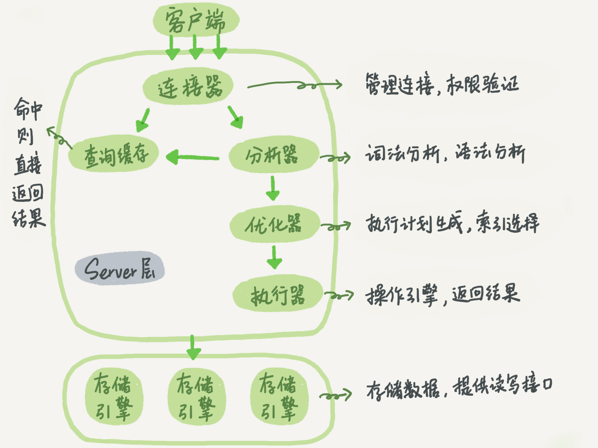

---
### 基础架构



#### 连接器
连接器用于和客户端建立连接，获取登陆用户的权限，维持和管理连接

对于长连接，由于查询过程中使用的临时内存放置在连接对象中，只有断开连接的时候才释放内存资源，所以如果连接长时间保持，则内存占用大，如果超过限制则会OOM，表现为MySQL异常重启了。对此，有两种解决方法：
1. 定期断开连接，或者程序里面判断如果操作了一个占用内存的大查询后，断开连接，之后要查询的时候重新连接
2. 在每次执行完一次大查询后，执行`mysql_reset_connection`来重新初始化连接，这个过程不需要重新获取权限和重连，只是将连接恢复到原始的状态

当客户端长时间无动静，连接器会断开连接，这个时间是通过参数`wait_timeout`控制的，默认是8小时

#### 查询缓存

查询缓存是对查询结果缓存起来，当下一次有相同的查询请求时，直接从缓存中获取结果返回，避免查询存储引擎，加快查询速度。

不过，不建议使用查询缓存，MySql8.0也将查询缓存的功能去掉了，原因是查询缓存的失效率很高，但凡有对一个表进行修改，都会将相关的缓存给清除掉


#### 分析器

包括词法分析，语法分析
#### 优化器
在表里面有多个索引的时候，决定使用哪个索引更快，或者在多表连接`join`的时候，决定表的连接顺序，优化器的目的是对于多个索引，找到执行代价最小的方案去执行，影响执行代价的元素包括：扫描行数、是否涉及到临时表和排序等
##### 索引的基数（cardinality）

查看索引的基数：`show index from t_user`

一个索引上不同值的个数，更为索引的基数，一个索引的基数越高，说明该索引的区分度会更好，MySQL计算索引的基数是采用采样统计的方法，通过设置`innodb_stats_persistent`来选择存储索引统计的方式

扫描行数的判断如果出现偏差，可以使用`analyze table T`来重新统计索引信息

即使某一个二级索引的扫描行数更少，但是优化器会考虑回表的消耗，可能会采用扫描行数更高的主键索引

对于不断地删除历史数据和新增数据的场景，可能会导致索引选择错误

##### 优化器索引选择异常的处理
- 使用`force index`强制使用索引
- 修改SQL语句，引导MySQL使用我们期望的索引，例如索引异常的情况如下`order by b limit 1`改为`order by b,a limit 1`就能从使用索引b变为使用索引a
- 用`limit 10000`来让优化器意识到使用某些索引的代价更高
- 在某些场景下，新建一个更合适的索引，来提供给优化器做选择，或删除误用的索引

如果经常对数据进行增删，那么数据由于MVCC会存在多个数据版本，对于非主键索引，它看到的数据包括历史数据版本的，因此可能优化器可能会错误选择索引，而主键是直接按照表的行数来估计的，而表的行数，优化器直接用的是slow table status的值


#### 执行器

首先判断对表是否有执行的权限，如果没有操作权限就报错，否则调用存储引擎接口来进行操作，在数据库的慢查询日志中有`rows_examined`字段，表示了语句执行过程中执行器调用存储引擎接口的次数

#### 存储引擎

存储引擎负责数据的存储和读取，其架构模式是插件式的，支持InnoDB、MyISAM、Memory等多个存储引擎

### 版本

MySql 5.7.34 与 MySql 8.0.25，目前常用的还是5.7版本


### MySQL语句的分类

- DDL（Data Definition Language，数据库定义语言），包括create,drop,alter等
- DML(Data Manipulation Language，数据库操纵语言)，包括select,delete,update,insert等
- DCL(Data Control Language，数据控制语言)，包括grant,revoke
- TCL(Transaction Control Language，事务控制语言)，包括savepoint,rollback,set transaction


---

### 日志系统

#### WAL(Write-ahead logging，预写式日志）

是关系数据库中用来保证原子性和持久性的一系列技术，关键就是先写日志，再写磁盘，日志文件通常包括redo和undo信息，具备crash-safe

#### redo log

- 是物理日志，意思是记录的内容是更新操作对具体的数据页进行的操作
- 存在于InnoDB存储引擎中
- 由于在硬盘中对数据进行更新耗费时间很久，所以将更新操作记录在redo log中，此时内存中的数据和磁盘中的数据不一致，内存中数据所在的页称为“脏页”，会根据策略将内存数据写入到磁盘，这个过程称为`flush`
- 大小是固定的，比如4个各2G的文件，循环写入redo log，因此当redo log满时，需要等待flush过程，此时系统不能更新数据
- crash-safe，在系统异常重启后，保证了数据的一致性，也就是说之前提交记录不会丢失

在内存中的数据更新之后，磁盘中的数据和内存中的数据不一致，我们称这个内存页为“脏页”，而一致的数据页，称为“干净页”

什么时候会进行flush？

- 当redo log满的时候，此时系统不能更新数据，导致系统处于不可用的状态
- 当内存满的时候，需要将长久不用的数据页淘汰，如果淘汰的是脏页，那么就需要将脏页写入磁盘
- 当系统空闲的时候
- MySQL正常关闭的时候

##### 刷脏页的控制策略

MySql需要获取机器的性能，从而控制刷脏页的速度，参数`innodb_io_capacity`表示了主机IO的能力，这个值一般设置为磁盘的IOPS，而IOPS可以通过以下语句了解`fio -filename=$filename -direct=1 -iodepth1 -thread -rw=randrw -ioengine=psync -bs=16k -size=500M -numjobs=10 -runtime=10 -group_reporting -name=mytest`

InnoDB刷脏页的速度会考虑两个因素，一个是脏页比例，一个是redo log写盘速度，参数`innodb_max_dirty_pages_pct`是脏页比例上限，默认值为75%，InnoDB会根据当前的脏页比例算出一个0~100的值为K1，根据redo log写入序号跟checkpoint对应序号的差值算出一个0~100的值为K2，取较大值为R，之后引擎根据innodb_io_capacity定义的能力乘以R%来控制刷脏页页的速度

脏页比例计算：

```mysql
1. `select VARIABLE_VALUE into @a from global_status where VARIABLE_NAME='Innodb_buffer_pool_pages_dirty';`
2. `select VARIABLE_VALUE into @b from global_status where VARIABLE_NAME='Innodb_buffer_pool_pages_total';`
3. `select @a/@b;`
```

当查询操作的时候，由于内存不足需要flush掉历史脏页，会导致查询操作更慢。而且，如果脏页旁边也是脏页的话，且参数`innodb_flush_neighbors`设置为1，那么连着的脏页会一起flush，而如果设置为0的话（默认），flush就只有一个脏页，在固态硬盘时代，IOPS已经不是瓶颈了，所以刷自己就好，8.0版本参数`innodb_flush_neighbors`就已经默认是0了

#### binlog

- 是逻辑日志，当中的内容是更新操作对查找数据字段的值修改多少，多是SQL语句
- 存在于Server层中
- 主要用于存储全部的更新操作记录，用于重现历史时刻

**查看binlog**：`mysqlbinlog -vv mysql-bin.000001 `

binlog的格式：

- statement：记录的是原始的sql语句，在主备同步的时候，可能会导致主备不一致
- row：记录的是完整的数据修改内容，大小比statement大。这也是建议设置的，同时也方便误操作后修复数据
- mix：上面两者的混合。

#### 日志的记录过程

比如执行`update t_user set count = count+1 where id = 3`这条更新语句，执行过程如下：

1. 执行器调用存储引擎的接口获取id=3这一行数据，存储引擎通过主键索引直接在B树中获取到数据。如果数据在内存中，则直接返回内存中的数据，否则需要到磁盘中读入内存，再返回数据给执行器。
2. 执行器获取到数据后，更新数据，比如原来count=99，更新后count的值变为100，将更新后的数据行发送回存储引擎。
3. 存储引擎将数据行写入到内存，然后生成redo log，状态为prepare，通知执行器自身执行完了，随时可以提交事务。
4. 执行器生成binlog，写入磁盘，调用存储引擎的提交事务接口
5. 存储引擎提交事务，将redo log的状态更新为commit

------

### 事务

事务简单来说就是一组数据库操作，要么全部执行成功，要么全部执行失败

#### 事务隔离级别

- 读未提交（read uncommitted）
- 读提交（read committed）
- 可重复读（repeatable read）
- 串行化（serializable）

#### 事务隔离的实现

事务隔离的具体实现是使用视图（read-view），可重复读是在事务开始的时候创建视图，读提交是在sql语句执行前重新算出一个新的视图，读未提交直接返回记录的最新值，串行化是加锁

对数据行进行更新操作会产生一个回滚日志，能够获取到数据行的历史数据，而视图就指向了数据行的回滚日志，从而能够获取到不同版本的数据，当没有视图指向旧的回滚日志的时候，才会删除回滚日志

需要注意的是，长事务会导致大量的回滚日志滞留，空间消耗大

这儿说的视图是支持读提交和可重复读隔离级别实现的`consistent read view`, 是InnoDB在实现MVVC时用到的一致性视图，它没有物理结构，主要的作用就是事务执行期间用来定义“我能看到什么数据”

#### 快照

每一条行记录是有多个数据版本的，每一次事务的更新操作都会生成一个数据版本，并且把事务的`transaction id`赋值给这个数据版本的事务ID，记为`row trx_id`

##### 实现快照？

InnoDB利用了所有数据都有多个版本的特性，实现了秒级创建快照的能力。对于可重复读，在事务启动的时候，对于数据版本大于该事务的数据版本，不认就行，当然了，对于还没有提交的事务，自然也是不可见的。

> 在实现上，InnoDB为每个事务都构造了一个数组，用来保存在当前事务启动瞬间，活跃的所有事务ID，活跃指的是已经创建了事务但是还没提交，数组里面事务ID最小的记为低水位，当前系统里面已经创建过的事务ID最大值+1为高水位，这个视图数组和高水位，就组成了当前事务的一致性视图（read-view）

事务中的更新逻辑？

> 事务中的更新数据都是先读后写的，而这个读是当前读，即是读当前最新的值，如果写的过程发现数据被其他事务上了写锁，则阻塞等待

为什么表的结构不支持可重复读？

> 因为表结构没有对应的行数据，也没有`row trx_id`，因此只能遵循当前读的逻辑

selete语句如果加了锁，也是当前读：1.加读锁`select k from t where id=1 lock in share mode;`; 2.加写锁`select k from t where id=1 for update;`

每一条记录在修改的时候都会记录一条回滚日志`undo log`，可以通过回滚操作得到之前的值，当记录的回滚日志不被事务需要的时候会被删除，也就是说没有比这个回滚日志更早的read-view时候会被删除

对于长事务，意味着会保留大量的回滚日志，存在很老的事务视图，对于可能访问的数据，数据的回滚记录都需要保留

#### 事务的启动方式

1. 显示启动，`begin`或`start transaction`，提交`commit`，回滚`rollback`
2. `set autocommit=0`,意味着只执行一个`select`，事务就会启动，直到`commit`或者`rollback`,或者断开连接

建议将`autocommit`设置为1，通过显示语句启动事务

`commit work and chain`:在`autocommit`为1的情况下，则效果为提交事务并且自动启动下一个事务

`begin/start transaction`命令并不是一个事务的起点，在执行第一个操作InnoDB表语句时，事务才真正启动；而`start transaction with consistent snapshot`则是马上启动一个事务

#### 如何避免长事务

- 应用开发端
  1. 确认使用了`set autocommit=0`
  2. 确认是否有不必要的只读事务，即查询操作也加上了事务
  3. 业务连接数据库的时候，设置`SET MAX_EXCUTION_TIME`来控制每条语句执行的最长时间，避免单个语句意外执行太长时间
- 数据库端
  1. 监控`information_schema.Innodb_trx`表，设置长事务阈值，超过就报警
  2. Percona的pt-kill工具
  3. 在业务功能测试阶段输出所有的general_log，分析日志行为提前发现问题
  4. 设置`innodb_undo_tablespaces`值为2（或者更大），这样undo就不会使用系统表空间，即ibdata1，而是使用独立的表空间，一般名称为undo001,undo002，当出现长事务导致回滚段过大，方便清理


查询长事务，持续60s以上的事务：`select * from information_schema.innodb_trx where TIME_TO_SEC(timediff(now(),trx_started))>60`

------

### 索引

索引其实就是为了加速查找数据的速度，常用的数据结构包括散列表、有序数组和搜索树，MySQL使用B+数，是多叉的，N的值约为1200左右，借此极大降低了树的高度，减少了读取磁盘的次数，索引是在存储引擎进行实现的，以下讨论的都是InnoDB下的索引设计

#### 索引类型

主键索引也叫作聚簇索引，叶子节点存放的是整行的数据，非主键索引也叫作二级索引，叶子节点存放的是主键的值，意味着当使用二级索引的时候，只能找到主键的值，如果需要其他的键值，需要到主键索引中查找整行的数据，这个过程称为回表

覆盖索引，意思是在二级索引中就能够获得需要查找的数据字段，不需要回表，覆盖索引可以显著减少树的搜索次数

联合索引，B+树的索引结构，可以利用索引的“最左前缀”，来定位记录，联合索引字段的顺序，一般是最常用的字段放在最前面，可以少维护索引树，其次使用“索引下推”来减少回表的次数，最左前缀可以是联合索引的最左 N 个字段，也可以是字符串索引的最左 M 个字符

索引下推

> MySQL 5.6 引入的索引下推优化（index condition pushdown)， 可以在索引遍历过程中，对索引中包含的字段先做判断，直接过滤掉不满足条件的记录，减少回表次数。
>
> 比如有联合索引`(name, sex)`，查询语句如下：
>
> `select * from t_user where name like "徐%" and sex = 1`
>
> 对于无索引下推的情况，记录(徐小白, 2)这条记录会进行回表操作，获取整行的数据，然后判断set
>
> 而对于索引下推，由于有联合索引，记录(徐小白, 2)这条记录直接就可以判断不符合查询条件，因此无需回表

#### 关于主键索引

为什么要使用自增主键？

> `NOT NULL PRIMARY KEY AUTO_INCREMENT`，每次增加数据，都是追加在最后面，对于主键索引树不会有节点的分裂和合并，如果是使用业务字段做主键，因为不一定每次都是追加在最后面，会导致树节点的分裂和合并,则写入数据维护索引树的成本更高；
>
> 其次，二级索引存储的是主键的值，如果是使用业务字段做主键，如果业务字段类型为长字符串，那么则二级索引的叶子节点需要的存储空间更高

可以使用业务逻辑字段作为主键索引的场景：

> Key-Value场景。只有一个索引，并且该索引是唯一的索引。而如果使用了自增主键，那么就会需要搜索两棵索引树


#### 索引的重建

索引可能因为页分裂等维护操作，导致结构有空缺，通过重建索引能够按顺序构建索引，使结构更紧凑，也节省空间。

非主键索引的重建可以直接删除索引，然后再添加

删除：`alter table T drop index k;`

添加：`alter table T add index(k);`

而主键索引，删除主键和创建主键都会将整个表重建，所以使用语句下面的一条语句即可：`alter table T engine=InnoDB`，效果基本上等于重建表

#### 唯一索引和普通索引

主键是肯定需要保证唯一性的，所以这儿所说的是非主键索引。总的来说，普通索引可以通过使用change buffer来提高数据更新效率，而唯一索引更新数据的时候由于要判断唯一性所以效率较低，因此，对于归档库（已经不存在重复）、客户端能够保证数据唯一性的场景，建议使用普通索引。

##### change buffer

当对数据进行更新的时候，如果数据页在内存中，则直接更新，如果不在内存中，则将更新操作缓存在`change buffer`中，在数据页由于查询被加载到内存之后，进行`merge`操作来更新数据，或者在空闲的时候，将更新操作写入磁盘从而更新磁盘中的数据信息

在查询数据的时候，唯一索引和普通索引的性能相差无几，而在更新数据的时候，对于唯一索引，所有的更新操作都需要判断操作是否违反唯一性约束，需要将数据页加载进内存，所以唯一索引没必要使用change buffer，因此只有普通索引需要使用change buffer

**change buffer适用场景**

对于写多读少的业务，如果使用了change buffer+普通索引，能够大大减少访问磁盘的次数，数据的更新都累计在change buffer中，能够批量性地对数据进行更新；而对于写完之后马上读取数据的，change buffer就没有存在的必要了，反而需要维护change buffer而需要耗费资源，因此change buffer记录的变更越多，收益越大

**change buffer VS redo log**

redo log 主要节省的是随机写磁盘的IO消耗（转为顺序写），而change buffer主要节省的是随机读磁盘的IO消耗

#### 怎么对字符串字段进行索引

1. 直接创建完整索引，如果字段长度过长，则很占用空间
2. 创建前缀索引，减少存储空间，但会增加回表次数，而且相应的扫描的行数也会增加，而且不能使用覆盖索引，因为需要回表对索引字段进行完整长度的判断
3. 对于识别度比较低的字符串创建前缀索引，如身份证号，由于前面的字符都是一样的，所以可以存储字符串的倒序，再在倒序的基础上创建前缀索引，如此一来，该索引不支持范围查询
4. 创建hash字段索引，添加一个字段值为hash值，性能稳定，也是不能支持范围查询

前缀索引太长则增加了索引的存储，减少了回表次数；而前缀索引太短则增加了回表次数，减少了索引的存储，因此我们应该选择合适的前缀索引的长度：

```
select count(distinct email) as L from User;
select count(distinct left(email,4)) as L4,
count(distinct left(email,5)) as L5,
count(distinct left(email,6)) as L6,
count(distinct left(email,7)) as L7 from User;

然后在L4~7中，选择大于L * 95% 的最小索引长度
```

对于类似身份证和手机号，前缀的区别度很低的场景，可以考虑的方案是：

1. 存储字段的时候，保存倒序后的结果，使用的MySql函数`reverse("123456")`
2. 新增一个额外的字段，保存字段的Hash值，可以直接使用MySql函数`crc32("123456")`

两个方案的对比：

1. 两者都不支持范围查询，只支持等值查询
2. 存储空间。倒序存储不需要额外的存储空间，而新增字段需要额外的存储空间和索引空间
3. 读写效率。reverse函数执行时间要短与crc32函数
4. 查询效率。通过Hash方式，基本上能够保证扫描行数在1行，而倒序的查询扫描行数大于1


### 删除表中的数据

表数据既可以存在共享表空间里，也可以是单独的文件。这个行为是由参数 innodb_file_per_table 控制的：

这个参数设置为 OFF 表示的是，表的数据放在系统共享表空间，也就是跟数据字典放在一起；

这个参数设置为 ON 表示的是，每个 InnoDB 表数据存储在一个以 .ibd 为后缀的文件中。

从 MySQL 5.6.6 版本开始，它的默认值就是 ON 了

建议设置为ON，每个表单独是一个文件，这样当执行类似`drop table`的时候，会自动清理掉这个文件。而且也方便手工删除

删除数据，这是将数据设置为“可复用”，数据还是占据空间，数据大小不会因为删除数据而变小，而且由于存储结构是数，容易导致很多“空洞”，如果要优化空间，则需要重建表

可以使用命令`alter table A engine=InnoDB`来重建表


### 重建表

大致过程是创建一个临时表，然后将正式表的数据插入到临时表，然后将临时表替换为正式表

需要注意的是，这个操作会导致表格暂时无法更新，因为添加了MDL写锁，为了保证数据的一致性

在 MySQL 5.6 版本开始引入的 Online DDL，对这个操作流程做了优化，具体是插入数据到临时表的时候，允许正式表更新（即将MDL写锁，降级为MDL读锁），将更新操作记录到日志文件中，等临时表数据插入完毕，再根据日志文件同步最新数据。

注意：重建表的时候，InnoDB 不会把整张表占满，每个页留了 1/16 给后续的更新用。也就是说，其实重建表之后不是“最”紧凑的，因此，重建表后，可能占用空间反而变大

**一些语句的区分**

- 从 MySQL 5.6 版本开始，alter table t engine = InnoDB（也就是 recreate）默认的就是上面图 4 的流程了；
- analyze table t 其实不是重建表，只是对表的索引信息做重新统计，没有修改数据，这个过程中加了 MDL 读锁；
- optimize table t 等于 recreate+analyze。


### 全局锁、表级锁、行锁

#### 全局锁

全局锁的使用场景是，做全库逻辑备份，使用命令`Flush tables with read lock(FTWRL)`，而对于使用InnoDB引擎的表，建议使用`mysqldump`，使用参数`-single-transaction`，在导数据前会启动一个事务，来确保拿到一致性视图，由于MVCC的支持，该过程中数据是可以正常更新的

避免通过`set global readonly=true`，设置全局只读来设置，原因主要是当出现异常的时候，FTWRL会自动释放全局锁，恢复到可用状态，而设置全局只读还需要手工设置，导致库较长时间处于不可写的状态；其次，这个值可能会被用来进行逻辑判断，比如判断是从库还是主库，修改则影响范围较大。

#### 表级锁

MySql表级锁有两种，一种是表锁，一种是元数据锁。通常来说我们比较少用表级锁，毕竟锁整个表代价比较高，而建议使用行锁

##### 表锁

表锁的语法是`lock table T read/write`，

##### 元数据锁（meta data lock, MDL）

元数据锁不需要显示使用，在访问表的时候会自动加上，对表做增删改查的时候会加上MDL读锁，对表做结构变更的时候会加上MDL写锁，事务提交的时候才会释放锁

例子：给表加字段导致表不可读写

客户端A开启事务对表格增删改查，这儿获取的是MDL读锁。客户端B开启事务对表格查询，这儿获取的也是MDL读锁，可以正常执行。客户端C给表加字段，此时需要获取MDL写锁，不过由于A和B的MDL读锁还没有释放，所以C会被阻塞。

后续如果还有客户端D需要对表进行查询，由于获取不到MDL读锁（因为C持有MDL写锁），D也阻塞了，至此，表格不可读也不可写。而且如果客户端有超时重试，后续会有大量的线程阻塞

如何安全地给表加字段？

> 首先检查是否有长事务，保证没有长事务存在，其次，对SQL语句设置等待时间，超过等待时间则放弃，不要阻塞后面的语句，通过重复执行SQL语句来实现增加字段，具体可以使用下面的语句：
>
> ALTER TABLE tbl_name NOWAIT add column ...
>
> ALTER TABLE tbl_name WAIT N add column ...

#### 行锁

MyISAM不支持行锁，InnoDB支持。行锁是在需要的时候才加上去的（不是在事务开始begin就加行锁，而是在update等语句执行前才加行锁），但是直到事务结束后才释放，这是两阶段锁协议，因此如果事务需要锁多各行，把最可能造成锁冲突的，最可能影响并发度的锁放到最后

行锁的实现？

> innodb行锁是通过锁索引记录来实现的，如果更新的列没有建立索引是会对扫描的数据逐行加锁的

当出现死锁的时候处理？

> 参数`innodb_deadlock_detect`一般设置为`on`，表示开启死锁检测功能，发现死锁后，主动回滚其中的一条事务，让其他事务得以执行

在高并发量的情况下，即有大量的请求同时更新同一行，死锁检测需要耗费大量的CPU资源，对于性能问题解决如下

> 1. 如果能够确保业务中一定不会出现死锁，那么可以临时把死锁检测给关掉，但是存在风险
> 2. 在数据库服务端控制并发量，在中间件或者MySQL中，对于相同行的更新，在进入引擎之前排队
> 3. 将更新一行的逻辑变为多行，比如更新1行数据变为更新10行中的随机一行，这样将冲突概率变为原来的1/10,，需要根据业务逻辑做详细设计，获取数据的时候，要累计10行的数据，而且当某一部分记录超出临界值（比如0）的时候需要做特殊处理

### information_schema

关于锁的表包括三个：

- innodb_trx：记录了事务的相关信息
- innodb_locks：记录了当前锁的相关信息
- innodb_waits：记录了锁等待的对应关系

------

### 读写分离

在分布式环境下，为了保证DB的高可用性和负载均衡，借鉴Master-Slave的思想，将读数据的SQL语句发送到Slave库中，将写数据的SQL语句发送到Master库中，Master和Slave保持数据的一致性，如果Master库挂掉了，则Slave临时成为Master

由于不同的SQL语句发送给不同的服务器，对于Tomcat来说有点麻烦，所以在Tomcat和DB中间加入MySQL Proxy这个中间层处理SQL语句的分发


### order by操作


线程会在内存中开辟一个空间`sort buffer`用来排序，当`sort_buffer_size`大于要排序的数据量时，使用快排在内存中进行内部排序，如果小于那么会利用磁盘临时文件辅助排序，使用归并进行外部排序，

使用以下的方法，来确定一个排序语句是否使用了临时文件?

```
/* 打开 optimizer_trace，只对本线程有效 */
SET optimizer_trace='enabled=on'; 
/* @a 保存 Innodb_rows_read 的初始值 */
select VARIABLE_VALUE into @a from  performance_schema.session_status where variable_name = 'Innodb_rows_read';
/* 执行语句 */
select city, name,age from t where city='杭州' order by name limit 1000; 
/* 查看 OPTIMIZER_TRACE 输出 */
SELECT * FROM `information_schema`.`OPTIMIZER_TRACE`\G
/* @b 保存 Innodb_rows_read 的当前值 */
select VARIABLE_VALUE into @b from performance_schema.session_status where variable_name = 'Innodb_rows_read';
/* 计算 Innodb_rows_read 差值 */
select @b-@a;
```

当中的`number_of_tep_files`指示使用了多少临时文件，如果为0，则只是内存排序，否则使用了临时文件辅助排序

#### 全字段排序

初始化sort_buffer，在二级索引中查找相应的数据，根据主键回表查找整行的数据，将数据放到sort buffer中，对sort buffer中的数据按照字段进行排序，将排好序的数据返回给客户端

#### rowid排序

如果一行的字段有很多的话，那么内存中能够放入的行数会很少，要分成为很多个临时的文件，排序的性能很差，因此可以设置
`SET max_length_for_sort_data = 16`,控制了用于排序的行数据的长度，如果超过了这个长度，那么进入sort buffer的字段只有主键和排序字段，最后排好序后需要进行回表查找完整的数据，所以通过上面计算的`select @b-@a`需要额外增加回表的行数

#### 全字段排序 VS rowid排序

- 对于InnoDB表来说，全字段排序能够减少磁盘的访问，因此会被优先选择
- 对于内存表来说，rowid排序的回表只是简单地根据数据行的位置，直接访问内存得到数据，并不会访问磁盘，因此对于只有内存操作来说，使用rowid排序更佳

#### 避免排序

- 如果有联合索引，那么可以避免排序，只需要在联合索引进行检索，回表查找相应数据按照顺序记录数据就可以(Using index condition)。比如有索引(city, name)，查询语句`select * from t where city = "guangzhou" order by name desc`
- 如果查询语句有覆盖索引，那么直接在联合索引处就能够获取足够的信息，不需要回表(Using index)，即查询语句：`select city, name, age from t  where city = "guangzhou" order by name desc`，而且有索引(city, name, age)，那么查询不需要回表

#### 额外的例子

> 查询语句：select * from t where city in ("杭州","苏州") ordr by name limit 100;
>
> 有联合索引(city,name)

那么执行过程如下所示：

1. 执行 select * from t where city=“杭州” order by name limit 100; 这个语句是不需要排序的，客户端用一个长度为 100 的内存数组 A 保存结果。
2. 执行 select * from t where city=“苏州” order by name limit 100; 用相同的方法，假设结果被存进了内存数组 B。
3. 现在 A 和 B 是两个有序数组，然后你可以用归并排序的思想，得到 name 最小的前 100 值，就是我们需要的结果了。

对于explain中的Extra，如果显示：`Using filesort`，则表示使用了排序

### count操作

InnoDB执行count操作需要将数据从存储引擎一行行读取到Server层，然后累积计数，原因是因为MVVC的缘故，需要判断每一行数据对于当前的事务是否可见，可见才累积计数

#### 怎么解决？

##### 用缓存系统（如Redis）存储计数值

然而毕竟内存数据会丢失，所以需要将数据写入到磁盘中，不过即使Redis正常工作，还是可能存在不一致，因为Redis数据更新和数据表的数据插入毕竟是两个操作，不是原子的，如果有查询在这两个操作之间进行了查询那么返回的数据就是不一致的

##### 数据库表来保存计数值

由于InnoDB要支持事务，所以执行count操作需要一行行读取到Server层

因此其实我们可以用一个表格来保存计数值，同时借助事务的特性，来解决使用Redis等第三方存储计数容易数据不一致的问题

#### 不同的count

优化器对count（*）进行了优化，不需要把全部字段取出来，不取值，按行累加，速度更快

具体的：主键索引由于叶子节点是具体的数据，而普通索引叶子节点只是主键，因此主键索引的大小要大于普通索引，InnoDB存储引擎会寻找最小的索引树，来执行count(*)操作，能够减少扫描的数据量

对于 count(主键 id) 来说，InnoDB 引擎会遍历整张表，把每一行的 id 值都取出来，返回给 server 层。server 层拿到 id 后，判断是不可能为空的，就按行累加。

对于 count(1) 来说，InnoDB 引擎遍历整张表，但不取值。server 层对于返回的每一行，放一个数字“1”进去，判断是不可能为空的，按行累加。

对于 count(字段) 来说：

- 如果这个“字段”是定义为 not null 的话，一行行地从记录里面读出这个字段，判断不能为 null，按行累加；

- 如果这个“字段”定义允许为 null，那么执行的时候，判断到有可能是 null，还要把值取出来再判断一下，不是 null 才累加。

性能上

> count(*) = count(1) > count(主键id) > count(字段)


### 随机数

获取随机数，可以使用的语句是：`select word from words order by rand() limit 3;`，需要注意的是，这个操作是比较繁琐的，而且也不推荐使用

- `order by rand()`使用了内存临时表(Using temporary)，内存临时表排序的时候是使用rowid排序方法
- `tmp_table_size`：内存临时表的大小，默认是16M，如果临时表大小超过了`tmp_table_size`，那么内存临时表就会转成磁盘临时表

#### 优先队列排序算法(堆排序)

当要排序的数据超过了tmp_table_size时，就不使用内存临时表了，如果limit a中a的值比较小，如果a的数据量不超过sort_buffer_size，那么会使用该算法，可以通过查看"filesort_priority_queue_optimization"中的"chosen字段是否为true来看是否使用了该算法

#### 取随机数的方法

```
取一个
mysql> select count(*) into @C from t;
set @Y = floor(@C * rand());
set @sql = concat("select * from t limit ", @Y, ",1");
prepare stmt from @sql;
execute stmt;
DEALLOCATE prepare stmt;

取三个
mysql> select count(*) into @C from t;
set @Y1 = floor(@C * rand());
set @Y2 = floor(@C * rand());
set @Y3 = floor(@C * rand());
set @M = max(@Y1,@Y2,@Y3)
set @N = min(@Y1,@Y2,@Y3)

select * from (
	select * from t limit N, M-N+1
) a
where a.id in (@Y1, @Y2, @Y3)
这样整体的扫描行数是 C + M + 3;

```

------

### 备份例子

```
set session transaction isolation level repeatable read;设置隔离级别
start transaction with consistent snapshop;得到一致性视图
savepoint sp;
show create table t1;
select * from t1;
rollback to savepoint sp;
继续对其他表重复上述过程
```

### 慢查询日志
slow log

#### 查看设置

- `show variables like 'slow_query%';`
- `show variables like 'long_query_time';`

#### 设置

- `set global slow_query_log='ON';`
- `set global slow_query_log_file='/usr/local/mysql/data/slow.log';`
- `set global long_query_time=1;`
- 重启客户端

使语句的执行保存到慢查询日志中

```mysql
set long_query_time=0;
select * from t ...
...
```


### 执行很慢的原因

#### 查询长时间不返回

##### 等MDL锁

1. show processlist看到State是“Waiting for table metadata lock"
2. 查找阻塞的pid，`select blocking_pid from sys.schema_table_lock_waits;`，需要注意的是，MySQL 启动时需要设置 performance_schema=on
3. KILL PID

##### 等Flush

1. show processlist看到State是“Waiting for table flush"
2. 但是一般flush的操作是很快的，所以应该是flush被其他线程A给堵住了
3. 将A线程给杀死

##### 等行锁

1. mysql> select * from t where id=1 lock in share mode; 
2. 该命令需要加读锁，如果已经有一个事务在这行持有一个写锁，那么select语句就会被阻塞
3. 查找这行持有写锁的信息：mysql> select * from t sys.innodb_lock_waits where locked_table=`'test'.'t'`\G
4. 可以看到“blocking_pid"就是阻塞的pid
5. 将持有写锁的pid杀掉：KILL PID

#### 查询慢

##### 例子1

`select * from t where id=1;`执行慢

`select * from t where id=1 lock in share mode;`执行反而快

场景如下：

| session A                                      | session B                                 |
| ---------------------------------------------- | ----------------------------------------- |
| start transaction with consistent snapshot;    | ~                                         |
| ~                                              | update t set c=c+1 where id=1 //执行100次 |
| select * from t where id=1;                    |                                           |
| select * from t where id=1 lock in share mode; |                                           |

- lock in share mode是当前读，会直接读到c的最新值
- 而普通的是一致性读，需要从c最新的值开始，一直undo执行了100次后，才能将数据返回，执行慢

##### 例子2

b字段定义为varchar(10)，且表中有10万行的b值为“1234567890”，执行语句`mysql> select * from table_a where b='1234567890abcd';`，这个语句执行很慢，原因是

mysql会将字符串截断为10个char的长度，由于是select*，所以需要回表10万次，但是每次查出整行，到server层一判断发现b字段不相同，最终结果返回空，如果N很大的话，那么花费的时间很多


### 避免对字段进行函数操作

对索引字段做函数操作，可能会破坏索引值的有序性，因此优化器就决定放弃走树搜索功能，导致的结果就是查询速度很慢

#### 对字段做了函数操作

- select * from TABLE where id + 1 = 100;
- select * from TABLE where month(t) = 7;
- 解决方式是不对字段使用函数，而是使用范围

#### 隐式类型转换

- select * from TABLE where tradeid = 100;(tradeid为varchar) 
- 在sql中，字符串和数字作比较的话，是将字符串转换成为数字
- 上面的语句等价于select * from TABLE where CAST(tradeid as signed int) = 100

#### 隐式字符编码转换

1. `select d.* from tradelog l, trade_detail d where d.tradeid=l.tradeid and l.id=2;`

2. 由于表d的字符集是utf8，而表l的字符集是utf8mb4，因此上面对字段进行了函数操作


**优化方法**

- 把trade_detail表中的tradeid字段的字符集修改为utf8mb4： `alter table trade_detail modify tradeid varchar(32) CHARACTER SET     utf8mb4 default null;`
- `select d.* from tradelog l , trade_detail d where d.tradeid=CONVERT(l.tradeid USING utf8) and l.id=2; `


### 幻读

可重复读事务隔离级别下，会存在幻读的情况。幻读指的是在一个事务中的两次查询，第二次查询查到了第一次查询不存在的数据行。

需要注意的是，对于普通的读是快照读，是不存在幻读的，而对于“当前读”，才会出现幻读。而且幻读仅仅指看到新插入的行，由于更新操作而导致的查询到新数据行不称为幻读。


InnoDB解决幻读的方式是使用间隙锁，用来锁行与行之间的间隙，从而阻塞其他事务的插入操作

间隙锁和行锁合称 next-key lock，每个 next-key lock 是前开后闭区间。

但是引入了间隙锁，会导致死锁问题，比如：

| session A                                           | session B                                           |
| --------------------------------------------------- | --------------------------------------------------- |
| begin;<br />select * from t where id=10 for update; |                                                     |
|                                                     | begin;<br />select * from t where id=10 for update; |
|                                                     | insert into t values(10, 10, 10);(阻塞)             |
| insert into t values(10, 10, 10);(阻塞)             |                                                     |
|                                                     |                                                     |


```mysql
session A 执行 select … for update 语句，由于 id=10 这一行并不存在，因此会加上间隙锁 (5,11);
session B 执行 select … for update 语句，同样会加上间隙锁 (5,11)，间隙锁之间不会冲突，因此这个语句可以执行成功；
session B 试图插入一行(10, 10, 10)，被 session A 的间隙锁挡住了，只好进入等待；
session A 试图插入一行(10, 10, 10)，被 session B 的间隙锁挡住了。
至此，形成了死锁，如果开启了死锁检测的话，SessionA会马上被检测然后返回错误，从而解除死锁
```

间隙锁只存在于可重复读隔离界别，为了解决幻读可以将事务隔离级别设置为读提交，同时为了解决可能出现的数据和日志不一致问题，需要设置binlog_format=row

如果读提交隔离级别够用，也就是说，业务不需要可重复读的保证，这样考虑到读提交下操作数据的锁范围更小（没有间隙锁），使用这个配置是合理的。当然，配置是否合理，跟业务场景有关，需要具体问题具体分析


### 出现问题时临时方案

#### 连接过多

当报错提示“Too many connections”时，增加`max_connections`的值，但是可能会导致MySql负载过大，破坏稳定性。更推荐的做法是将那些建立了连接但是并没有执行操作的（状态为Sleep）、无事务的连接杀死，是否有事务通过命令查看`select * from information_schema.innodb_trx`，杀死连接通过`kill connection + id`

当连接被MySql服务器杀死后，客户端在下一次请求的时候，才会提示错误：`ERROR 2013 (HY000): Lost connection to MySQL server during query”`，客户端需要重新建立连接，然后使用新的连接发送请求

#### 慢查询

1. 缺少索引，通过Online DDL马上添加索引，对于一主一从，可以进行如下操作：
   1. 在备库 B 上执行 set sql_log_bin=off，也就是不写 binlog，然后执行 alter table 语句加上索引；
   2. 执行主备切换；
   3. 这时候主库是 B，备库是 A。在 A 上执行 set sql_log_bin=off，然后执行 alter table 语句加上索引。
2. 选错索引或者语句没有写好，通过query_rewrite功能，增加`force index`

#### QPS增加

1. 一种是由全新业务的 bug 导致的。假设你的 DB 运维是比较规范的，也就是说白名单是一个个加的。这种情况下，如果你能够确定业务方会下掉这个功能，只是时间上没那么快，那么就可以从数据库端直接把白名单去掉。
2. 如果这个新功能使用的是单独的数据库用户，可以用管理员账号把这个用户删掉，然后断开现有连接。这样，这个新功能的连接不成功，由它引发的 QPS 就会变成 0。
3. 如果这个新增的功能跟主体功能是部署在一起的，那么我们只能通过处理语句来限制。这时，我们可以使用上面提到的查询重写功能，把压力最大的 SQL 语句直接重写成"select 1"返回，不过不一定有效，因为一般来说不会只有一类SQL语句。


### union all 和union

都是将两个select结果集进行合并，区别如下

- 对于有重复的行，union会进行去重，而union all不会；
- 对于有序的结果，union会重新进行排序，而union all只是简单拼接两个结果

性能的话当然是union all更快

### 反引号

mysql语句的表名和字段都会添加反引号(`\``)，目的是为了区分Mysql的保留字和普通字符，当使用了保留字作为字段的话不加反引号会报错，比如

```
create table `test` (
    `id` bigint(20) NOT NULL AUTO_INCREMENT,
    `rank` varchar(10)
    `desc` varchar(255)
)
```

在8.0版本，rank是关键字，如果不加反引号会报错


### 优化

大小表join使用mapjoin
字段和值类型匹配
在关联之前，将条件过滤放到字句
查询sql中过滤掉脏数据
避免笛卡尔积 
先groupby 后在join
增加分区信息，减少sql解析时的内存占用

#### select

- 对于查询结果只有一条的，加上`limit 1`，这样找到结果后就不会再继续扫描
- 如果允许重复并且不要排序结果，使用union all而不是union

### Interesting SQL

- `update tbl_name set str_col="xxx" = "yyy"` 等同于 `update tbl_name set str_col=0`
- `select id,str_col from tbl_name where str_col="xxx" = "yyy";`


### 多表join
阿里巴巴java开发手册说，禁止超过3个表以上的join，而且需要确保索引存在。优化的方式是，拆分sql语句为多条简单的sql语句，整体上来看，多条简单sql语句效率会比一条多表join的sql语句要高


### query_rewrite 功能

MySQL 5.7 提供了 query_rewrite 功能，可以把输入的一条语句改写成另外一条语句

通过执行`mysql-5.7.34-winx64\share\install_rewriter.sql`安装功能

新增规则：`insert into query_rewrite.rewrite_rules(pattern, replacement, pattern_database) values ("select * from t where id + 1 = ?", "select * from t where id = ? - 1", "db1");`

使规则生效：`call query_rewrite.flush_rewrite_rules();`

在执行语句后，可以通过`show warnings`查看语句是否进行了变更


### 误删除操作

#### delete删除行

使用`Flashback`工具通过修改binlog（生成逆转操作）来恢复原始数据，需要设置了`binlog_format=row 和 binlog_row_image=FULL`。最好的做法是在从库上使用工具回复原始数据，确认数据后在同步到主库

#### drop table/ truncate table删除表、删除数据库

前提条件是数据库有定时全量备份，并且实时备份binlog。具体的恢复就是全量备份+增量binlog日志的方式，比如，每日有进行一次全量的备份，中午12点时删了表，具体操作是：

1. 获取最近一次的全量备份，应用到一个临时库中
2. 获取0点以后的所有binlog，剔除掉删表的语句，具体：
   1. 如果原实例没有使用 GTID 模式，只能在应用到包含 12 点的 binlog 文件的时候，先用–stop-position 参数执行到误操作之前的日志，然后再用–start-position 从误操作之后的日志继续执行；
   2. 如果实例使用了 GTID 模式，就方便多了。假设误操作命令的 GTID 是 gtid1，那么只需要执行 set gtid_next=gtid1;begin;commit; 先把这个 GTID 加到临时实例的 GTID 集合，之后按顺序执行 binlog 的时候，就会自动跳过误操作的语句。
3. 全部应用到临时库中，具体是`mysqlbinlog –database db_name`
4. 将临时库中的表同步到MySql集群中

不过，上述的操作不够快，主要原因是mysqlbinlog不能指定表，恢复的是整个数据库；其次，mysqlbinlog解析日志和应用日志的过程是单线程的

更快的方法如下：

1. 使用全量备份生成临时实例后，将其设置为线上备库的从库
2. 设置`change replication filter replicate_do_table = (tbl_name)`，表示只同步指定的表，然后`start slave`。需要注意的是，备库中需要有0点后的全部binlog，如果缺少了部分binlog，我们需要手工从其他binlog备份中获取并添加到备库中，具体：
   1. 假设通过`show binlog`查看到备库中最小的binlog文件是master.000004，缺少了master.000003（判断是否缺少看binlog中的时间）
   2. 从其他binlog备份中获取master.000003，放置到备库中
   3. 打开日志文件中的`master.index`，添加`./master.000003`
   4. 重启备库，使其识别到新的binlog
3. 至此备库中已经存在全部的binlog了， 建立主备关系后即可

再比如全量备份是一周一次，然后在周六的时候误操作了，那么需要重放6天的binlog，还是很慢，对于这种场景，可以尝试配置延迟同步的备库，在备库上执行`CHANGE MASTER TO MASTER_DELAY = N` 命令，可以指定这个备库持续保持跟主库有 N 秒的延迟。如果设置了3600，则表示备库和主库有1个小时的延迟，如果在1个小时内发现了误操作，操作是：

1. 马上停止同步备库：`stop slave`
2. 将主库中的binlog剔除掉误操作的日志，在备库重放，可以很快得获取到原始数据

#### rm 删除数据库实例

删除实例的影响是最小的，因为其不会影响数据的一致性，只会让整个集群压力增大，只需要重新启动数据库实例即可

#### 预防措施

1. 把 sql_safe_updates 参数设置为 on。这样一来，如果我们忘记在 delete 或者 update 语句中写 where 条件，或者 where 条件里面没有包含索引字段的话，这条语句的执行就会报错。
2. 代码上线前，必须经过 SQL 审计。
3. 只给开发配置DML，不允许drop/truncate
4. 在删除数据表之前，先将表重命名为其他名字，比如添加统一删除后缀`_to_be_delete`，观察现场日志是否存在问题，不存在在问题则由DB统一删除具有统一后缀的表


### 查询后的数据发送给客户端

查询数据，MqSql是边读边发，意味着，如果客户端接收的慢，也会导致mysql发送得慢，具体如下：

1. MySql的Server层从存储引擎中获取到一行数据后，将数据写入到`net buffer`，大小由`net_buffer_length`控制，默认是16K
2. 重复获取行，写入`net buffer`，直到其写满，然后调用网络接口发送出去
3. 如果发送成功，则清空`net buffer`，获取下一行数据
4. 如果调用接口失败，返回EAGAIN 或 WSAEWOULDBLOCK，则表示本地网络栈(Socket send buffer)满了，需要等待，直到本地网络栈可写

如果连接的状态显示“Sending to client”，就表示服务器端的网络栈写满了。

如果客户端使用–quick 参数，会使用 mysql_use_result 方法。这个方法是读一行处理一行，如果业务逻辑处理比较慢，会导致客户端接受慢，继而导致mysql服务端本地网络栈堆积

因此，如果数据量可以接收，一般使用mysql_store_result 这个接口，mysql客户端直接把查询结果保存到本地内存。

#### 大数据量全表扫描的影响

数据查询后会放置在Buffer Pool中，下一次相同的查询，可以直接返回而不用查询磁盘，提高了查询效率，Buffer Pool的命中率可以通过`show engine innodb status`中的信息查看

InnoDB Buffer Pool的大小由`innodb_buffer_pool_size`进行控制，通常设置为可用物理内存的60%~80%。

对于大数据量的查询，容易将Buffer Pool塞满，然后通过LRU算法淘汰掉常用的数据查询，导致Buffer Pool的命中率直线下降，磁盘压力增大，影响常用数据查询的效率。

实际上，InnoDB对LRU算法进行了优化的，其将整条链表分成两部分，按照5:3的比例，分别是Young区域和Old区域，Old区域的头为OLD_HEAD。改进后的策略是：

1. 如果查询的数据在Young区域，那么将数据移动到Head；
2. 如果Buffer Pool满了，那么还是淘汰掉链条尾部的数据，将数据插入到OLD_HEAD
3. 如果查询的数据在Old区域：
   1. 数据在链表存在不足1秒，将数据移动到Old区域的Head，即OLD_HEAD;
   2. 数据在链表存在超过了1秒，那么将数据移动到Young区域的头部，即HEAD;
   3. 上述时间由参数`innodb_old_blocks_time`控制，默认是1000，单位是毫秒

可以看到，对于大数据量的全表扫描，数据只会存在于Old区域，不会淘汰Young区域的数据，因此能够保证正常业务逻辑数据的查询


### 用户和权限

mysql中，用户名（user）+地址（host)才是一个用户，因此，`jy@localhost`和`jy@192.168.53.2`，是两个用户

创建用户：`create user 'ua'@'%' identified by 'pa';`

创建用户的操作，会在磁盘上，往 mysql.user 表里插入一行，由于没有指定权限，所以这行数据上所有表示权限的字段的值都是 N；内存里，往数组 acl_users 里插入一个 acl_user 对象，这个对象的 access 字段值为 0。

#### 全局权限

赋予全部权限：`grant all privileges on *.* to 'ua'@'%' with grant option;`

这个 grant 命令做了两个动作：磁盘上，将 mysql.user 表里，用户’ua’@’%'这一行的所有表示权限的字段的值都修改为‘Y’；内存里，从数组 acl_users 中找到这个用户对应的对象，将 access 值（权限位）修改为二进制的“全 1”。

收回用户的权限：`revoke all privileges on *.* from 'ua'@'%';`

#### DB权限

赋予权限：`grant all privileges on db1.* to 'ua'@'%' with grant option;`

基于库的权限记录保存在 mysql.db 表中，在内存里则保存在数组 acl_dbs 中。

这条 grant 命令做了如下两个动作：磁盘上，往 mysql.db 表中插入了一行记录，所有权限位字段设置为“Y”；内存里，增加一个对象到数组 acl_dbs 中，这个对象的权限位为“全 1”。

#### 全局权限和DB权限

对于全局权限，在线程建立连接后会将权限信息复制到线程对象中，因此对于全局权限进行`revoke`，不会影响已经建立的连接

对于DB权限，线程是对全局变量acl_dbs进行判断，因此对于DB权限进行`revoke`，立即就会修改acl_dbs数组，因此会影响已经建立的连接

而对于一开始就执行了`use db_test`，会将对数据库的权限写入到会话变量中，除非切换数据库，否则会话持有的对db_test的权限不会改变


#### 表权限和列权限

```
create table db1.t1(id int, a int);
// 表权限
grant all privileges on db1.t1 to 'ua'@'%' with grant option;
// 列权限
GRANT SELECT(id), INSERT (id,a) ON mydb.mytbl TO 'ua'@'%' with grant option;
```

除了 db 级别的权限外，MySQL 支持更细粒度的表权限和列权限。其中，表权限定义存放在表 mysql.tables_priv 中，列权限定义存放在表 mysql.columns_priv 中。这两类权限，组合起来存放在内存的 hash 结构 column_priv_hash 中。

和DB权限一样，这两类权限都会更新数据表，更新内存，会影响到所有的已建立的连接

flush privileges 命令会清空 acl_users 数组，然后从 mysql.user 表中读取数据重新加载，重新构造一个 acl_users 数组。也就是说，以数据表中的数据为准，会将全局权限内存数组重新加载一遍。同样的，DB权限，表权限和列权限也做了相同的处理。

因此，正常情况下，grant 命令之后，没有必要跟着执行 flush privileges 命令。

flush privileges 使用场景：

一般是非规范的操作，导致了数据表和内存数据不一致，比如直接修改了mysql.user的数据，那么需要通过语句更新内存的数据。


### 节点健康检测

建立对mysql节点的健康监测，当监测显示节点存在异常时，需要及时进行主备切换、节点下线等操作，常用的监测方法如下：

#### select 1

通过执行`select 1`，如果有返回则表表示节点正常，否则异常

但是对于线程数量用尽，新的请求无法执行的情况，`select 1`还是会正常返回结果，无法及时获取到该节点的请求已阻塞

#### 查表判断

为了能够检测到InnoDB并发线程数太多而导致不可用的情况，需要执行访问表的语句，可以构建一个表`health_check`，里面只有一行数据，然后定期执行`select * from health_check`，看是否能够返回结果

但是查表操作，无法判断binlog写满后，更新操作阻塞的情况，因此需要将查表语句修改为更新语句

#### 更新判断

表增加一个timestamp子字段，定期执行语句`update mysql.health_check set t_modified=now();`

对于一主多从的mysql集群，需要同时监测主节点和从节点，如果在所有节点上执行以上语句，会导致数据不一致，进而导致主从同步停止，因此执行的语句需要增加节点的标识，即增加server_id字段

```mysql
mysql> CREATE TABLE `health_check` (
  `id` int(11) NOT NULL,
  `t_modified` timestamp NOT NULL DEFAULT CURRENT_TIMESTAMP,
  PRIMARY KEY (`id`)
) ENGINE=InnoDB;

/* 检测命令 */
insert into mysql.health_check(id, t_modified) values (@@server_id, now()) on duplicate key update t_modified=now();
```

需要注意的是，以上的方法（select 1、查表判断、更新判断）都是在mysql外部判断健康状况，存在一定的随机性，可能不能及时监测到

#### 开启mysql的性能监控

而如果对mysql本身的数据进行监测判断，则能够做到准确监测，MySQL 5.6 版本以后提供的 performance_schema 库，就在 file_summary_by_event_name 表里统计了每次 IO 请求的时间，如果开启了这个统计功能，会导致mysql的性能下降10%左右。

开启redo log的时间监控：`mysql> update setup_instruments set ENABLED='YES', Timed='YES' where name like '%wait/io/file/innodb/innodb_log_file%';`

监测数据，设定阈值，单次 IO 请求时间超过 200 毫秒属于异常：`mysql> select event_name,MAX_TIMER_WAIT  FROM performance_schema.file_summary_by_event_name where event_name in ('wait/io/file/innodb/innodb_log_file','wait/io/file/sql/binlog') and MAX_TIMER_WAIT>200*1000000000;`

发现异常数据后，获取需要的信息，然后将之前的统计信息清空`mysql> truncate table performance_schema.file_summary_by_event_name;`，当下一次出现异常信息后，将值添加到监控累计值即可。

### 数据导出和导入

下面的例子是将db1.t的数据复制到db2.t

#### mysqldump

导出：

```mysql
mysqldump -h$host -P$port -u$user --add-locks=0 --no-create-info --single-transaction  --set-gtid-purged=OFF db1 t --where="a>900" --result-file=/wasHome/client_tmp/t.sql

--single-transaction：不对表db1.t加表锁
–add-locks 设置为 0，表示在输出的文件结果里，不增加" LOCK TABLES t WRITE;" ；
–no-create-info 的意思是，不需要导出表结构；
–set-gtid-purged=off 表示的是，不输出跟 GTID 相关的信息；
–skip-extended-insert：一行数据一行insert
```

下面的两种导入都可以

导入：`mysql -h127.0.0.1 -P13000  -uroot db2 -e "source /client_tmp/t.sql"`

导入：`mysql -h127.0.0.1 -P13000  -uroot db2  < /client_tmp/t.sql`

#### CSV 

导出：`select * from db1.t where a>900 into outfile '/server_tmp/t.csv';`

导出文件的路径受secure_file_priv的控制：如果设置为 empty，表示不限制文件生成的位置，这是不安全的设置；如果设置为一个表示路径的字符串，就要求生成的文件只能放在这个指定的目录，或者它的子目录；如果设置为 NULL，就表示禁止在这个 MySQL 实例上执行 select … into outfile 操作。

导入：`load data infile '/server_tmp/t.csv' into table db2.t;`

select …into outfile 方法不会生成表结构文件，只有数据

mysqldump 提供了一个–tab 参数，可以同时导出表结构定义文件和 csv 数据文件，分别为t.sql和t.txt

`mysqldump -h$host -P$port -u$user ---single-transaction  --set-gtid-purged=OFF db1 t --where="a>900" --tab=$secure_file_priv`

#### 物理拷贝

以上的方法都是逻辑拷贝，即先生成源数据，然后将源数据导入到新表中。

mysql提供了物理拷贝，即直接操作.ibd文件，这种方式是最快的，具体流程：

1. 执行 create table r like t，创建一个相同表结构的空表；
2. 执行 alter table r discard tablespace，这时候 r.ibd 文件会被删除；
3. 执行 flush table t for export，这时候 db1 目录下会生成一个 t.cfg 文件；
4. 在 db1 目录下执行 cp t.cfg r.cfg; cp t.ibd r.ibd；这两个命令（这里需要注意的是，拷贝得到的两个文件，MySQL 进程要有读写权限）；
5. 执行 unlock tables，这时候 t.cfg 文件会被删除；
6. 执行 alter table r import tablespace，将这个 r.ibd 文件作为表 r 的新的表空间，由于这个文件的数据内容和 t.ibd 是相同的，所以表 r 中就有了和表 t 相同的数据。


### 数据可靠性

只要保证redo log和binlog持久化到磁盘，mysql数据库异常重启后，数据可以恢复，提供一定的数据可靠性。

#### binlog的写入机制

事务执行过程中，先将日志写入到binlog cache中，事务提交的时候，再把binlog cache写到硬盘的binlog文件中

每个线程都有独立的binlog cache，在内存中占据一定的空间，大小由`binlog_cache_size`控制，从binlog cache到磁盘的binlog文件会有两个过程：

- write：binlog cache到文件系统的page cache，所有线程的binlog cache 都共享同一个page cache binlog文件，此时还不是写磁盘，速度快
- fsync：真正的写磁盘，此时才占用磁盘的IOPS，速度慢

write 和 fsync 的时机，是由参数 sync_binlog 控制的：

- sync_binlog=0 的时候，表示每次提交事务都只 write，不 fsync；
- sync_binlog=1 的时候，表示每次提交事务都会执行 fsync；
- sync_binlog=N(N>1) 的时候，表示每次提交事务都 write，但累积 N 个事务后才 fsync。

#### redo log的写入机制

日志先写到 redo log buffer，然后根据策略`innodb_flush_log_at_trx_commit`写入到磁盘：

- 设置为 0 的时候，表示每次事务提交时都只是把 redo log 留在 redo log buffer 中 ;
- 设置为 1 的时候，表示每次事务提交时都将 redo log 直接持久化到磁盘；
- 设置为 2 的时候，表示每次事务提交时都只是把 redo log 写到 page cache。

而且mysql后台有起一个定时任务，每秒执行，会将redo log buffer中的的日志，调用 write 写到文件系统的 page cache，然后调用 fsync 持久化到磁盘

对于还没有提交的事务，redo log也可能会被持久化到磁盘，比如

对于并发事务，事务A写了部分redo log到redo log buffer中，但是还没有提交，而事务B进行了提交，如果``innodb_flush_log_at_trx_commit = 1`，那么事务B会将redo log buffer中的全部内容持久化到磁盘，因此导致事务A还没提交但是持久化到了磁盘

如果把 innodb_flush_log_at_trx_commit 设置成 1，那么 redo log 在 prepare 阶段就要持久化一次，在commit的时候也要提交一次

#### 组提交机制

即将多个需要持久化的操作在一次磁盘IO中完成，主要是指fsync操作，能够大幅降低磁盘的IOPS

通常来说，写日志的大致过程是：

redo log prepare持久化 -> binlog持久化 ->redo log commit持久化，

而实际上由于持久化包括write和fsync两个操作，且两个操作一个快速，一个缓慢，细化后的写日志过程是：

redo log prepare write -> binlog write -> redo log prepare fsync-> binlog fsync->redo log commit持久化

redo log prepare fsync和binlog fsync操作都可以使用组提交机制，通常来说redo log prepare fsync执行相对较快，因此binlog fsync操作的日志数量还是较少，因此如果稍微“等待”一下，使得一次IO操作能够有更多的日志，可以提高mysql的IO性能，可以通过设置下面两个参数来实现。

- binlog_group_commit_sync_delay 参数，表示延迟多少微秒后才调用 fsync;
- binlog_group_commit_sync_no_delay_count 参数，表示累积多少次以后才调用 fsync。

两个参数是或操作，只要有一个满足条件就会调用fsync


### 主备同步

通常来说，备库最好设置为只读（readonly），原因是：

1. 备库可以执行一些读操作，设置为只读可以避免业务系统不小心发送了其他命令导致错误；
2. 避免主备切换的时候，由于双写导致的数据不一致；
3. 设置为只读，方便判断节点的状态

同步的操作具体是：

1. 在备库 B 上通过 change master 命令，设置主库 A 的 IP、端口、用户名、密码，以及要从哪个位置开始请求 binlog，这个位置包含文件名和日志偏移量。
2. 在备库 B 上执行 start slave 命令，这时候备库会启动两个线程，就是图中的 io_thread 和 sql_thread。其中 io_thread 负责与主库建立连接。
3. 主库 A 校验完用户名、密码后，开始按照备库 B 传过来的位置，从本地读取 binlog，发给 B。
4. 备库 B 拿到 binlog 后，写到本地文件，称为中转日志（relay log）。
5. sql_thread 读取中转日志，解析出日志里的命令，并执行。


对于双M架构，即主节点和从节点互为主备，主备同步的过程：

1. 节点A执行事务后生成的binlog，server id是A。
2. 节点B接收到binlog后，重放，然后节点B生成的binlog中，server id还是A
3. 节点A接收到的binlog，发现server id是A，即自己，将跳过这条binlog，只执行server id不是自己的binlog内容


### 高可用

高可用架构一般是双M架构，有一个备库随时等待选主为master，由于主从同步会存在延迟，延迟可以通过下面查看：

```shell
show slave status 
它的返回结果里面会显示 seconds_behind_master，即为同步延迟的时间
```

主备延迟的原因：

1. 备库所在的机器性能比主库差；
2. 备库通常会分担业务系统的查询请求，如果查询请求导致备库压力过大，会导致备库执行主库的binlog效率低下；
3. 大事务。因为事务提交的时候，才会生成binlog发送给备库，备库才会重放binlog，如果大事务执行时间长，那么将会导致长时间的主备延迟。典型的场景比如大数据量的delete，或者大表的DDL操作
4. 备库的并行复制能力低。

主备切换根据场景可以分为：可靠性优先策略和可用性优先策略

可靠性优先策略：

1. 判断备库 B 现在的 seconds_behind_master，如果小于某个值（比如 5 秒）继续下一步，否则持续重试这一步；
2. 把主库 A 改成只读状态，即把 readonly 设置为 true；
3. 判断备库 B 的 seconds_behind_master 的值，直到这个值变成 0 为止；
4. 把备库 B 改成可读写状态，也就是把 readonly 设置为 false；
5. 把业务请求切到备库 B。

这种策略能够保证数据有较高的可靠性，但是会存在短暂的不可用（比如5秒）

可用性优先策略：

可用性优先策略是不等主备数据同步，直接把连接切到备库 B，并且让备库 B 可以读写，可能会导致部分数据不一致。

通常来说，数据更为重要，因此最好使用可靠性优先策略


### 备库并行复制能力


